## Descripción de los datos

### Información general

```         
 - *Bioproject*: PRJNA675355
 - *Número de acceso de la base de datos GEO*: GSE161045
 - *Especie*: Homo sapiens
 - *Número de transcriptomas*: 12 
 - *Número de réplicas biológicas*: 6 de control (SRX9456983, SRX9456984, SRX9456985, SRX9456986),  4 replicas de Parkinson disease (SRX9456991, SRX9456992, SRX9456993, SRX9456994), y 4 de Alzheimer Disease (SRX9456987, SRX9456988, 
SRX9456989, SRX9456990).
 - *Secuenciador empleado*: Illumina Nova-seq 6000
 - *Protocolo usado*: Chromiun
 - *Tipo de captura*: sn-RNAseq
 - *Protocolo*: Chromium single cell 3'V3
 - *Células capturadas en total*: 38929, con cada replica aportando aproximadamente la misma cantidad de células.
 
### Artículo científico
```

#### Human striatal glia differentially contribute to AD- and PD-specific neurodegeneration, por Jinbin Xu et. al.

Xu, J., Farsad, H. L., Hou, Y., Barclay, K., Lopez, B. A., Yamada, S., Saliu, I. O., Shi, Y., Knight, W. C., Bateman, R. J., Benzinger, T. L. S., Yi, J. J., Li, Q., Wang, T., Perlmutter, J. S., Morris, J. C., & Zhao, G. (2023). Human striatal glia differentially contribute to AD- and PD-specific neurodegeneration. Nature Aging, 3(3), 346–365. https://doi.org/10.1038/s43587-023-00363-8

## Abstract del artículo

La enfermedad de Alzheimer, Parkinson y Huntington se dan debido a acumulaciones de proteínas anormales en el cerebro, es por esto que las diferencias y similitudes entre los pathways que dan lugar a la enfermedad Enfermedad de Parkinson y el Alzheimer son muchas veces, desconocidas. Este artículo propone que el perfil transcriptómico de las microglias en ámbos desordenes comparados con los controles nos puede dar más información acerca de las diferencias entre si y como afecta la neurodegeneración y patologías amiloides.

::::: columns
::: {.column width="80%"}
Este atrículo describe los estados transcriptómicos de nucelos individuales, específicamente en subpoblaciones de 3 tipos celulares:

-   **Astrocitos**: Se decribieron tres sub-poblaciones de astrocitos altamente conservadas entre ratones y humanos. Espefícicamente, se revelaron características similares entre astrocitos de AD y PD, así como sus diferencias regionales que contribuyen a la neurodegeneración y amiloidopatías.

-   **Microglías**: En el caso de las microglías activadas, los cambios transcriptómicos entre ámbas patologías son únicas para cada desorden.

-   **Indeterminadas**: Por último, también describieron los perfiles transcriptómicos de poblaciones no descritas anteriormente, viendo como cambian en ámbas patologías.
:::

::: {.column width="20%"}
[**Paper:** Xu, J., et. al (2023). Human striatal glia differentially contribute to AD- and PD-specific neurodegeneration. Nature Aging, 3(3), 346–365. <https://doi.org/10.1038/s43587-023-00363-8>]{style="font-size:70%;"}

[AD: Alzheimer's disease, PD: Parkinson's disease]{style="font-size:70%;"}
:::
:::::

## Las proteínas defectuosas por patología son:

::::::: columns
**AD**:

-   Proteínas Beta-Amiloide

-   Neurofibrillas de proteína Tau

**PD**:

-   Cuerpos de Lewy

::: {style="font-size:70%;"}
En un cerebro no patológico, la **microglía** actúa como un limpiador de estas acumulaciones. Esto lo hace mediante la **fagocitosis** de acumulaciones proteicas, ya sean extra o intracelulares. En este último caso, puede fagocitarse la neurona completa.
:::

::: {.column width="30%"}
{width="90%"}
:::

::: {.column width="30%"}
:::

::: {.column width="30%"}
{width="90%"}
:::
:::::::

### Resultados del artículo

Se identificaron tres subpoblaciones de astrocitos y dos de microglia conservados a través de diferentes regiones y condiciones del cerebro. El estudio reflejó genes asociados a la activación de microglias tanto en PD, AD y glioblastoma multiforme. También revelaron activación específica de estados de perfiles transcriptómicos de microglía dependiendo de la enfermedad.

## Objetivo

Conociendo esta información previa, es evidente que tanto AD como PD comparten muchas características. Es por esto que las diferencias y similitudes entre los pathways que las producen son muchas veces, **desconocidas**.

Este artículo propone que el perfil transcriptómico de las microglias en ámbos desordenes comparados con los controles nos puede dar más información acerca de las diferencias entre si y como afecta la neurodegeneración y patologías amiloides.

### Diseño experimental

Tejido cerebral clinica y neuropatológicamente bien definido fue recolectado de donadores humanos fallecidos. . Se clasificaron los estadios de las enfermedades en base a acumulaciones de proteína beta amiloide. Después, se hizo snRNA-seq del tejido y se alineo contra la referencia después del curamiento de datos. Esto se hizo con el fin de agrupar poblaciones celulares entre los tejidos y observar las diferencias entre los astrocitos y microglías del grupo de control, con PD o AD, así como también de células inmunes y neuronas. Tmabién se relaizó un análisis de expresión diferencial en cada muestra.

# Pipeline ([Version completa](https://3lconejo.github.io/Proyecto-Final-scRNA-seq/))

------------------------------------------------------------------------

# Fase 0 · Configuración del Entorno

> El objetivo de esta fase, es establecer nuestro entorno para ejercer buenas practicas bioinformaticas, cargar las librerias necesarias para analisis posteriores, y establecer decisiones de diseño para visualizaciones.

```{r}
#| label: setup

rm(list = ls())

# Crear estructura de carpetas de salida
dirs <- c(
  "QC_results",
  "seurat_objects",
  "markers_results",
  "clustering_results",
  "DEG_results"
)
for (d in dirs) dir.create(d, showWarnings = FALSE, recursive = TRUE)

# Librerías
library(DoubletFinder)
library(Matrix)
library(GEOquery)
library(hdf5r)
library(rhdf5)
library(dplyr)
library(tidyverse)
library(ggplot2)
library(patchwork)
library(Seurat)
library(ggrepel)
library(RColorBrewer)
library(viridis)
library(scales)
library(ComplexHeatmap)
library(circlize)
library(clusterProfiler)
library(org.Hs.eg.db)
library(enrichplot)
library(ggh4x)

# Paleta global de condiciones
pal_condition <- c("CTRL" = "#4CAF7D", "AD" = "#E05C4B", "PD" = "#4B7FBE")

# Paleta de tipos celulares
pal_celltypes <- c(
  "Astrocyte"              = "#E05C4B",
  "Oligodendrocyte"        = "#4B7FBE",
  "Microglia"              = "#4CAF7D",
  "D1 medium spiny neuron" = "#F5A623",
  "D2 medium spiny neuron" = "#91A623",
  "Capillary EC"           = "#9B59B6",
  "CFD+MGP+ fibroblast"    = "#1ABC9C",
  "LYVE1 macrophage"       = "#E67E22",
  "Memory CD4 T cell"      = "#E91E63",
  "Pericyte"               = "#607D8B",
  "Splatter neuron"        = "#95A5A6",
  "False"                  = "#BDC3C7"
)

cat("Entorno configurado correctamente.\n")
cat("Carpetas creadas:", paste(dirs, collapse = ", "), "\n")
```

------------------------------------------------------------------------

# Fase 1 · Datos Crudos (`data/`)

> El objetivo de esta fase es obtener los datos crudos a partir del acceso [GSE161045](https://www.ncbi.nlm.nih.gov/geo/query/acc.cgi), ordenarlos, y cargarlos como objetos seurat para posteriormente hacer un control de calidad.

## Descarga de Archivos Raw (GEO)

```{r}
#| label: descarga
#| eval: false   # Ejecutar solo la primera vez

dir.create("data", showWarnings = FALSE)

library(GEOquery)
getGEOSuppFiles("GSE161045", baseDir = "data/")
untar("data/GSE161045/GSE161045_RAW.tar", exdir = "data/GSE161045_RAW")
cat("Archivos descargados:\n")
list.files("data/GSE161045_RAW", recursive = TRUE)
```

## Lectura y Ensamblaje de Muestras

```{r}
#| label: lectura-muestras
#| eval: false   # Ejecutar solo la primera vez

base_dir   <- "data/GSE161045_RAW"
all_files  <- list.files(base_dir, recursive = FALSE)

# Extraer IDs GSM únicos
ids <- sapply(basename(all_files), function(x) {
  parts <- strsplit(x, "_")[[1]]
  paste(parts[1:2], collapse = "_")
})
unique_ids <- unique(ids)

# Reorganizar en subcarpetas por muestra
for (id in unique_ids) {
  target_dir <- file.path(base_dir, id)
  dir.create(target_dir, showWarnings = FALSE)
  id_files <- all_files[grepl(id, basename(all_files))]
  
  for (f in id_files) {
    new_path <- file.path(target_dir, basename(f))
    file.copy(file.path(base_dir, basename(f)), new_path)
  }
}

# Renombrar a formato estándar 10x
sample_dirs <- list.dirs(base_dir, recursive = FALSE)
for (d in sample_dirs) {
  files <- list.files(d, full.names = TRUE)
  for (f in files) {
    new_name <- basename(f)
    new_name <- sub(".*matrix\\.mtx\\.gz$",  "matrix.mtx.gz",  new_name)
    new_name <- sub(".*barcodes\\.tsv\\.gz$", "barcodes.tsv.gz", new_name)
    new_name <- sub(".*features\\.tsv\\.gz$", "features.tsv.gz", new_name)
    file.rename(f, file.path(d, new_name))
  }
}

# Leer matrices
data_list   <- lapply(sample_dirs, Read10X)
names(data_list) <- basename(sample_dirs)

seurat_list <- lapply(names(data_list), function(n) {
  CreateSeuratObject(counts = data_list[[n]], project = n, min.cells = 5)
})
names(seurat_list) <- names(data_list)

# Combinar en un solo objeto
seurat_obj <- merge(
  x = seurat_list[[1]],
  y = seurat_list[-1],
  add.cell.ids = names(seurat_list)
)

seurat_obj$sample    <- sub("^(GSM[0-9]+_[A-Z0-9]+)_.*", "\\1", colnames(seurat_obj))
seurat_obj$condition <- sub(".*_(CTRL|AD|PD).*", "\\1", colnames(seurat_obj))
seurat_obj$orig.ident <- sub(".*_(CTRL[0-9]+|AD[0-9]+|PD[0-9]+)$", "\\1", seurat_obj$sample)

saveRDS(seurat_obj, "seurat_objects/seurat_raw.rds")
cat("Objeto raw guardado.\nCélulas totales:", ncol(seurat_obj), "\n")
```

------------------------------------------------------------------------

# Fase 2 · Control de Calidad (`QC_results/`)

> El objetivo de esta fase, es quedarnos con informacion relevante, con suficiente poder estadistico para darnos informacion relevante sobre el tema de estudio, en este caso, comparar el perfil transcripcional de individuos con Alzheimer y Parkinson, frente a un grupo control.

```{r}
#| label: carga-raw

seurat_obj <- readRDS("seurat_objects/seurat_raw.rds")
cat("Células antes del filtrado:", ncol(seurat_obj), "\n")
table(seurat_obj$condition)
```

## Cálculo de Métricas QC

-   **Genes mitocondriales (`^MT-`)**

    -   Calidad celular (apoptosis, estrés).

-   **Genes ribosomales (**`^RP[SL]`**)**

    -   Altos porcentajes de genes ribosomales pueden reflejar células en estados de alta síntesis proteica o, en algunos casos, ruido técnico.
    -   Sirven para evaluar si ciertos clusters están dominados por ribosomas más que por señales biológicas relevantes.

-   **Genes de hemoglobina (**`^HB`**)**

    -   Se expresan en células de origen eritroide o contaminaciones de glóbulos rojos.
    -   Un alto porcentaje puede indicar contaminación de eritrocitos en la preparación de PBMCs, en este caso, al estar trabajando con tejido cerebral, no esperiamos una poblacion de PBMCs.

-   **Marcadores de plaquetas (**`PECAM1|PF4`**)**

    -   Se usan para detectar contaminación por plaquetas o subpoblaciones plaquetarias.
    -   Ayudan a decidir si excluir esas células o interpretarlas como una población real.

```{r}
#| label: calculo-qc

# Porcentajes de genes por categoría
seurat_obj <- PercentageFeatureSet(seurat_obj, "^MT-",         col.name = "percent_mito")
seurat_obj <- PercentageFeatureSet(seurat_obj, "^RP[SL]",      col.name = "percent_ribo")
seurat_obj <- PercentageFeatureSet(seurat_obj, "^HB[^(P|E|S)]", col.name = "percent_hb")
seurat_obj <- PercentageFeatureSet(seurat_obj, "PECAM1|PF4",   col.name = "percent_plat")

# Resumen estadístico
summary_qc <- seurat_obj@meta.data %>%
  group_by(condition) %>%
  summarise(
    n_cells       = n(),
    median_genes  = median(nFeature_RNA),
    median_UMI    = median(nCount_RNA),
    median_mito   = round(median(percent_mito), 2),
    .groups = "drop"
  )

knitr::kable(summary_qc, caption = "Resumen QC por condición")
```

## Visualización QC

```{r}
#| label: plot-qc-violin
#| fig-cap: "Distribución de métricas QC por muestra"

feats <- c("nFeature_RNA", "nCount_RNA", "percent_mito", "percent_ribo")
VlnPlot(
  seurat_obj,
  features = feats,
  group.by = "orig.ident",
  pt.size  = 0,
  ncol     = 2
) &
  theme(
    axis.text.x = element_text(angle = 45, hjust = 1, size = 7),
    plot.title  = element_text(size = 10)
  )
ggsave("QC_results/QC_violins.jpeg", width = 10, height = 8, dpi = 300)
```
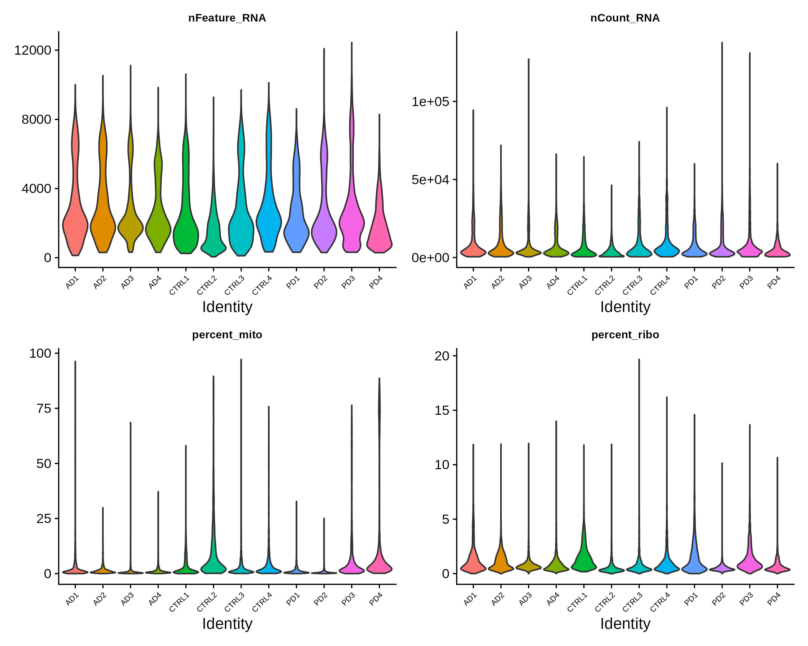
En la grafica, se puede ver que las muestras tienen propiedades similares, con un numero de genes alto por muestra y lecturas que pueden alcanzar valores de 5 cifras.

```{r}
#| label: plot-qc-scatter
#| fig-cap: "Relación UMI vs genes detectados (umbrales Xu et al. 2023)"

FeatureScatter(
  seurat_obj,
  feature1 = "nCount_RNA",
  feature2 = "nFeature_RNA",
  group.by = "condition",
  pt.size  = 0.3
) +
  scale_color_manual(values = pal_condition) +
  geom_hline(yintercept = c(500, 9000),   linetype = "dashed", color = "grey30") +
  geom_vline(xintercept = c(500, 70000),  linetype = "dashed", color = "grey30") +
  labs(
    title    = "QC · Umbrales de filtrado (Xu et al. 2023)",
    subtitle = "Líneas punteadas: límites nFeature [500, 9000] · nCount [500, 70,000]"
  )
ggsave("QC_results/QC_FeatureScatter.jpeg", width = 10, height = 8, dpi = 300)
```
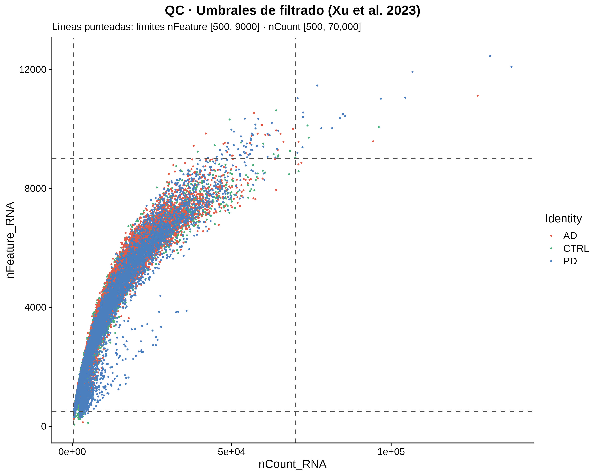
Basandonos en el articulo original, filtramos los datos teniendo en cuenta su naturaleza,
las neuronas tienden a expresar más genes por lo que se establecio un rango de entre
500-9000 genes, y un numero de UMIs mayor a 500 y menor a 70000, no se uso el parametro de ribosomas, debido a que este experimento se realizo con muestras obtenidas del nucleo de la celula.
## Filtrado de Células

```{r}
#| label: filtrado

# Parámetros de Xu et al. 2023
data_filt <- subset(
  seurat_obj,
  subset = nFeature_RNA > 500  &
           nFeature_RNA < 9000 &
           nCount_RNA   > 500  &
           nCount_RNA   < 70000 &
           percent_mito < 10
  # Nota: percent_ribo NO se filtra en snRNA-seq cerebral
  # (los ribosomas están en el citoplasma, ausentes en núcleos aislados)
)

cat("Células antes del filtrado:", ncol(seurat_obj), "\n")
cat("Células después del filtrado:", ncol(data_filt), "\n")
cat("Células eliminadas:", ncol(seurat_obj) - ncol(data_filt), "\n\n")
table(data_filt$condition)

# Guardar reporte QC
write.csv( data_filt@meta.data %>% dplyr::select(orig.ident, condition, nFeature_RNA, nCount_RNA, percent_mito), "QC_results/qc_metrics_filtered.csv", row.names = TRUE )
```

```{r}
#| label: plot-post-filter
#| fig-cap: "Distribución post-filtrado"

VlnPlot(
  data_filt,
  features = c("nFeature_RNA", "nCount_RNA", "percent_mito"),
  group.by = "condition",
  cols     = pal_condition,
  pt.size  = 0,
  ncol     = 3
) &
  theme(axis.text.x = element_text(angle = 30, hjust = 1))
ggsave("QC_results/postQC_violins.jpeg", width = 10, height = 8, dpi = 300)
```
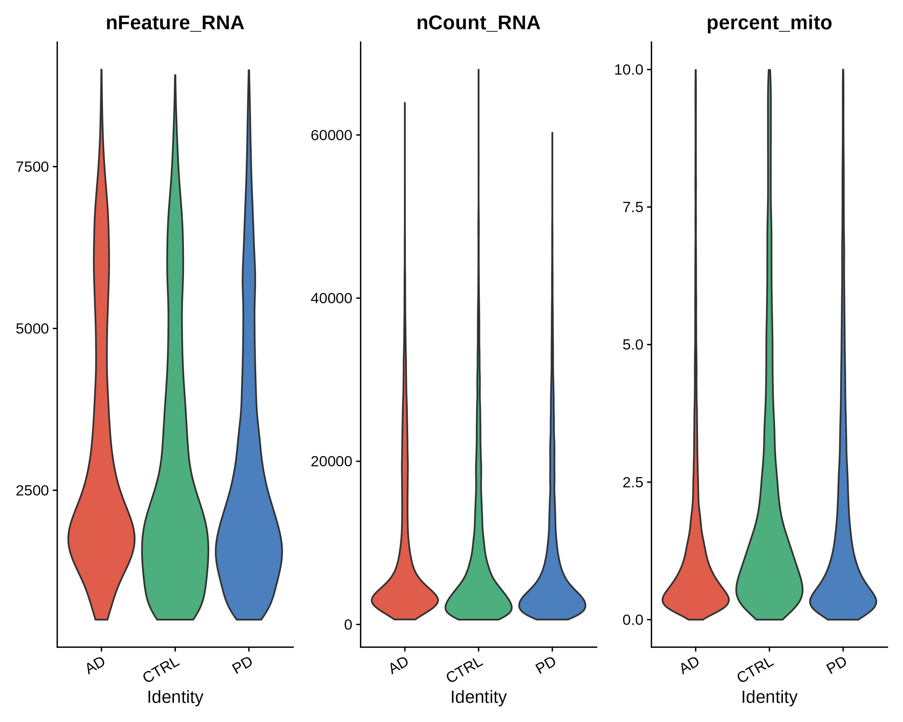
Podemos ver que los datos entre condiciones siguen los filtros aplicados previamente.

## Filtrado de células con baja calidad

> \[ CORRECCIÓN METODOLÓGICA: Ampliación de Umbrales Tisulares \]
>
> Se han re-calibrado los umbrales empíricamente para el estriado post-mortem. Se establece el mínimo en 500 genes y el techo heurístico se eleva hasta 9,000 para no erradicar las masivas Neuronas Espinosas Medias. La tolerancia mitocondrial sube al 10% para no sesgar las poblaciones gliales en estrés neuropatológico.

```{r}
data.filt <- subset(seurat_obj, subset = nFeature_RNA > 500 & 
                      nFeature_RNA < 9000 & 
                      percent_mito < 10 &
                      percent_ribo < 1)
dim(data.filt)
table(data.filt$orig.ident)

```

### Exploración de abundancia génica (MALAT1 y Top Genes)

```{r}

layers <- Layers(data.filt, assay = "RNA")

cell_counts <- lapply(layers, function(mat) {
  mat <- LayerData(
    seurat_obj,
    assay = "RNA",
    layer = "counts.GSM4888887_CTRL1"
  )
})
names(cell_counts) <- sub(".*_", "", names(cell_counts))

gene_totals <- lapply(cell_counts, function(mat) rowSums(mat))
top_genes <- lapply(gene_totals, function(x) sort(x, decreasing = TRUE)[1:10])

expr_cells <- lapply(cell_counts, function(mat) {
  # número de células con al menos 1 lectura por gen
  cells_per_gene <- rowSums(mat > 0)
  names(cells_per_gene) <- rownames(mat)
  cells_per_gene
})

df_expr <- do.call(rbind, lapply(names(expr_cells), function(name) {
  data.frame(
    # el nombre del dataset actual.
    dataset = name,
    #  los nombres de los genes en ese dataset.
    gene = names(expr_cells[[name]]),
    #  el número de células que expresan cada gen.
    cells = expr_cells[[name]]
  )
}))

# 2. Filtrar solo los top genes
# lapply va a recorre cada nombre de dataset en la lista.
# do.call Une todos esos data.frame en uno solo, apilándolos fila por fila.
df_top <- do.call(rbind, lapply(names(top_genes), function(name) {
  # obtiene los nombres de los genes top 10 de ese dataset.
  genes <- names(top_genes[[name]])
  data.frame(
    # el nombre del dataset
    dataset = name,
    # el nombre del gen
    gene = genes,
    # busca en expr_cells cuántas células expresan esos genes específicos.
    cells = expr_cells[[name]][genes]
  )
}))

write.csv(df_top, file = "QC_results/top_genes_per_sample.csv")

# Porcentaje de MALAT1
malat1_percent <- lapply(cell_counts, function(mat) {
  gene_counts <- mat["MALAT1", ]          
  total_counts <- colSums(mat)            
  100 * gene_counts / total_counts        
})

malat1_summary <- lapply(malat1_percent, function(pct) {
  total_cells <- length(pct)
  cells_above <- sum(pct > 20)      
  percent_cells <- 100 * cells_above / total_cells
  list(total_cells = total_cells, cells_above = cells_above, percent_cells = percent_cells)
})

total_cells_all <- sum(sapply(malat1_summary, function(x) x$total_cells))
cells_above_all <- sum(sapply(malat1_summary, function(x) x$cells_above))
percent_global <- 100 * cells_above_all / total_cells_all
cat("Porcentaje global de células >20% MALAT1:", percent_global, "%\n")
```

Se obtuvo un porcentaje muy bajo de celulas (0.06%) que expresan un 20% de MALAT1, indicando que la calidad general de nuestros datos es buena.

## Normalización y Modelado de la Varianza (SCTransform)

> \[CORRECCIÓN METODOLÓGICA: SCTransform \]
>
> LogNormalize falla al atenuar la sobredispersión masiva cerebral. Reemplazamos esto por un marco robusto de regresión binomial negativa (SCTransform) y regulamos el ruido mitocondrial directamente aquí.

```{r}
library(DoubletFinder)
data_filt <- NormalizeData(data_filt, verbose = F)

neuro_pca <- RunPCA(data_filt, verbose = F, npcs = 20)
DimPlot(neuro_pca, reduction = "pca") + ggtitle("PCA con genes variables")
ElbowPlot(pbmc_pca)
pbmc_jack <- JackStraw(neuro_pca, num.replicate = 100)
# Asignar puntuaciones de significancia a las PCs
pbmc_jack <- ScoreJackStraw(neuro_jack, dims = 1:20)
# Visualizar las PCs significativas
JackStrawPlot(neuro_jack, dims = 1:20)

# Dividimos el objeto por lote para su integración posterior
obj.list <- SplitObject(data_filt, split.by = "orig.ident")

obj.list <- lapply(obj.list, function(obj) {
  
  obj <- SCTransform(obj, vars.to.regress = c("nCount_RNA", "percent_mito"), verbose = FALSE)
  
  obj <- RunPCA(obj, verbose = FALSE)
  obj <- FindNeighbors(obj, dims = 1:30)
  obj <- FindClusters(obj, resolution = 0.5)
  return(obj)
})

```

## Integración de datasets (Análisis de Correlación Canónica)

> \[ CORRECCIÓN METODOLÓGICA: Integración por Anclajes CCA \]
>
> Se rechaza el motor de integración difuso iterativo (Harmony) que asume vecindades genéricas. Se adopta la integración rígida de Anclajes (MNNs) del entorno CCA adaptado para SCTransform, lo cual es innegociable para converger sobre los ejes biológicos continuos entre pacientes (Ej: capturar transiciones de microglías DAM).

```{r}
# Seleccionar características de integración
features <- SelectIntegrationFeatures(object.list = obj.list, nfeatures = 3000)
obj.list <- PrepSCTIntegration(object.list = obj.list, anchor.features = features)

# Calcular anclajes (k.filter se ajusta a 20 para precisión neuropatológica)
anchors <- FindIntegrationAnchors(object.list = obj.list, normalization.method = "SCT", 
                                  anchor.features = features, k.filter = 20)

# Ensamblaje integrado
neuro_integrated <- IntegrateData(anchorset = anchors, normalization.method = "SCT")

```

## Reducción de dimensiones no lineales y Clustering

> \[ CORRECCIÓN METODOLÓGICA: Resolución y PCA \]
>
> Expandimos drásticamente los dominios retenidos a 30 PCs para preservar ejes de varianza sutil que distinguen microglias en transición. Reducimos la resolución global a un particionamiento ultra-mega-hyper-super-duper-conservador (`resolution = 0.1`).

```{r}
neuro_integrated <- RunPCA(neuro_integrated, npcs = 30, verbose = FALSE)

# Exploración
ElbowPlot(neuro_integrated, ndims = 30)
ggsave("QC_results/ElbowPlot.jpeg", width = 10, height = 8, dpi = 300)

# Clustering
neuro_integrated <- FindNeighbors(neuro_integrated, reduction = "pca", dims = 1:30)
neuro_integrated <- FindClusters(neuro_integrated, resolution = 0.1, cluster.name = "global_clusters")

# UMAP
neuro_integrated <- RunUMAP(neuro_integrated, reduction = "pca", dims = 1:30, verbose = FALSE)

DimPlot(neuro_integrated, reduction = "umap", group.by = c("orig.ident", "condition", "global_clusters"))
ggsave("QC_results/umap_combined.jpeg", width = 10, height = 8, dpi = 300)
```
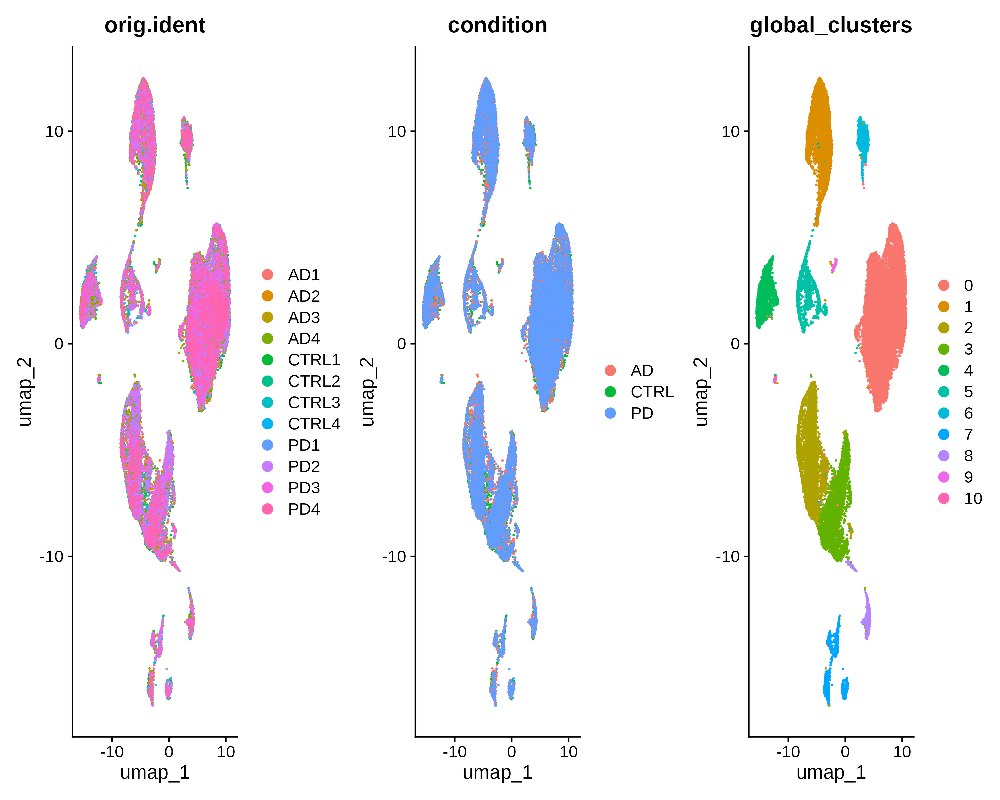
Con una resolucion baja (0.1) se formaron 10 principales clusters a partir de los datos,
y gracias a la integracion, parece que estos responden exclusivamente a la biologia de los datos, no a sesgos tecnicos.
```{r}
saveRDS(neuro_integrated, file = "seurat_objects/neuro_integrated_cca.rds")
```

# Fase 3 · Clustering (`clustering_results/`)
> El objetivo de esta fase es que a partir de los genes de los datos, se caracterice un cluster con una identidad celular.

## Carga del Objeto Integrado

```{r}
#| label: carga-integrado

# Mapeo muestra → condición
id_condition_map <- data.frame(
  orig.ident  = as.character(1:12),
  condition   = c(rep("CTRL", 4), rep("AD", 4), rep("PD", 4)),
  sample_name = c(paste0("CTRL", 1:4), paste0("AD", 1:4), paste0("PD", 1:4))
)

neuro_integrated <- readRDS("seurat_objects/neuro_integrated_cca.rds")

neuro_integrated@meta.data$sample_name <- id_condition_map$sample_name[
  match(neuro_integrated@meta.data$orig.ident, id_condition_map$orig.ident)
]

sel.clust <- "global_clusters"
alldata   <- SetIdent(neuro_integrated, value = sel.clust)

cat("Células totales:", ncol(neuro_integrated), "\n")
cat("Clusters encontrados:", nlevels(Idents(alldata)), "\n")
table(pbmc_integrated$condition)
```

## UMAP Global

```{r}
#| label: umap-global
#| fig-cap: "UMAP coloreado por condición y cluster"

p_cond <- DimPlot(
  pbmc_integrated, reduction = "umap",
  group.by = "condition", cols = pal_condition, pt.size = 0.3
) + NoAxes() + ggtitle("Por condición")

p_clus <- DimPlot(
  pbmc_integrated, reduction = "umap",
  group.by = sel.clust, label = TRUE, label.size = 3, pt.size = 0.3
) + NoAxes() + ggtitle("Por cluster")

p_cond + p_clus + plot_layout(guides = "collect")
ggsave("clustering_results/condition_umap.jpeg", width = 10, height = 8, dpi = 300)
```

```{r}
#| label: umap-split
#| fig-cap: "UMAP separado por condición"

DimPlot(
  pbmc_integrated,
  reduction = "umap",
  split.by  = "condition",
  group.by  = sel.clust,
  label     = TRUE, label.size = 2.5,
  pt.size   = 0.3,
  ncol      = 3
) + NoAxes()
ggsave("clustering_results/umap_by_condition.jpeg", width = 10, height = 8, dpi = 300)

# Guardar coordenadas UMAP
umap_coords <- as.data.frame(Embeddings(pbmc_integrated, "umap"))
umap_coords$cluster   <- pbmc_integrated@meta.data[[sel.clust]]
umap_coords$condition <- pbmc_integrated$condition
write.csv(umap_coords, "clustering_results/umap_coordinates.csv")
```
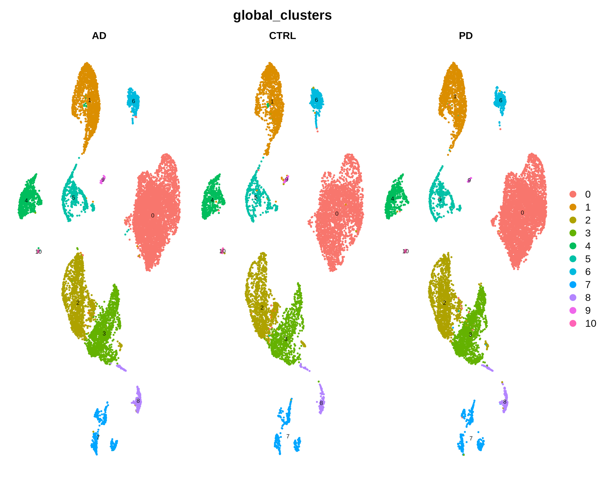
En la grafica, se muestra similutudes a traves de las distintas condiciones presentes,
solo habiendo cambios en la cantidad de celulas en cada cluster.

## Anotación Celular (Azimuth)

Este es un paso critico, donde usando una version mejorada de Azimuth que ahora integra un
Atlas para encontrar cualquier tipo de celulas usando la funcion `CloudAzimuth()`, podremos caracterizar cada cluster y asignarle una identidad, para corroborar visualmente la cercania de cada poblacion y los genes presentes en esta.

```{r}
#| label: anotacion-azimuth


library(AzimuthAPI)
library(tidyverse)
# Unimos las capas crudas del RNA antes de mandarlo a Azimuth
DefaultAssay(neuro_integrated) <- "RNA"
neuro_integrated <- JoinLayers(neuro_integrated)
# [CORRECCIÓN] Ejecutamos Azimuth y guardamos temporalmente el resultado
azimuth_output <- CloudAzimuth(neuro_integrated)

# Transferimos las etiquetas al objeto original (el cual tiene el UMAP intacto)
neuro_integrated$azimuth_fine <- azimuth_output$azimuth_fine
neuro_integrated$azimuth_broad <- azimuth_output$azimuth_broad

# Continuamos el pipeline usando el objeto original que ya tiene las anotaciones añadidas
saveRDS(neuro_integrated, file = "seurat_objects/neuro_annotated.rds")

neuro_annotated <- readRDS("seurat_objects/neuro_annotated.rds")

# Asignar tipo celular dominante por cluster
cluster_celltype <- neuro_annotated@meta.data %>%
  group_by(.data[[sel.clust]], azimuth_fine) %>%
  summarise(n = n(), .groups = "drop") %>%
  group_by(.data[[sel.clust]]) %>%
  slice_max(n, n = 1, with_ties = FALSE) %>%
  ungroup()

colnames(cluster_celltype)[1] <- "cluster"
colnames(cluster_celltype)[2] <- "top_celltype"

cluster_vector  <- as.character(neuro_annotated@meta.data[[sel.clust]])
celltype_labels <- cluster_celltype$top_celltype[
  match(cluster_vector, as.character(cluster_celltype$cluster))
]
neuro_annotated@meta.data$celltype_azimuth <- celltype_labels

# Tabla de correspondencia cluster → tipo celular
knitr::kable(
  cluster_celltype %>% dplyr::select(cluster, top_celltype, n) %>% arrange(as.numeric(cluster)),
  caption = "Cluster → Tipo celular (Azimuth)"
)

# Guardar tabla
write.csv(cluster_celltype, "clustering_results/cluster_celltype_map.csv", row.names = FALSE)
```

```{r}
#| label: umap-celltypes
#| fig-cap: "UMAP con tipos celulares anotados"

neuro_clean <- subset(neuro_annotated,
                      subset = celltype_azimuth %in% c("False", "Splatter neuron"),
                      invert = TRUE)

DimPlot(
  neuro_clean,
  group.by   = "celltype_azimuth",
  label      = TRUE, label.size = 3, repel = TRUE,
  pt.size    = 0.3
) +
  NoAxes() +
  scale_color_manual(values = pal_celltypes) +
  labs(title = "Tipos celulares · Azimuth") +
  theme(legend.text = element_text(size = 8))
ggsave("clustering_results/umap_azimuth.jpeg", width = 10, height = 8, dpi = 300)
```
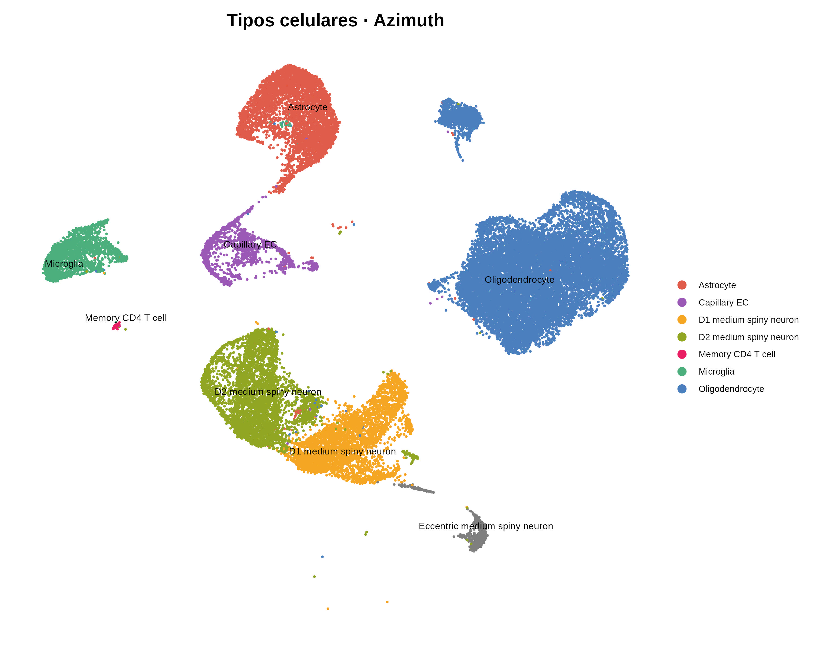
Encontramos distintas poblaciones celulares, pero nos vamos a centrar en 4: Microglias, Oligodendrocitos, Spiny Neurons (D1) y Astrocitos, ya que fueron el principal foco del articulo original.

```{r}
#| label: composicion-celular
#| fig-cap: "Composición de tipos celulares por condición"

prop_df <- neuro_clean@meta.data %>%
  filter(!is.na(celltype_azimuth)) %>%
  mutate(condition = factor(condition, levels = c("CTRL", "AD", "PD"))) %>%
  group_by(condition, celltype_azimuth) %>%
  summarise(n = n(), .groups = "drop") %>%
  group_by(condition) %>%
  mutate(prop = n / sum(n))

ggplot(prop_df, aes(x = condition, y = prop, fill = celltype_azimuth)) +
  geom_bar(stat = "identity", position = "stack",
           color = "white", linewidth = 0.2) +
  scale_fill_manual(values = pal_celltypes, name = "Tipo celular") +
  scale_y_continuous(labels = percent_format()) +
  scale_x_discrete(labels = c("CTRL" = "Control")) +
  labs(title = "Composición celular por condición",
       x = NULL, y = "Proporción") +
  theme_classic(base_size = 12) +
  theme(plot.title = element_text(face = "bold"))
ggsave("clustering_results/Cell_Composition.jpeg", width = 10, height = 8, dpi = 300)

# Guardar tabla de proporciones
write.csv(prop_df, "clustering_results/celltype_proportions.csv", row.names = FALSE)
```

## FeaturePlots — Marcadores Canónicos

Basados en los genes marcadores descritos por el articulo original, decidimos corroborar si nuestros clusters estaban presentando correctamente los susodichos.

```{r}
#| label: feature-plots
#| fig-cap: "Expresión de marcadores canónicos del estriado"

spectral_pal <- rev(brewer.pal(n = 11, name = "Spectral"))

genes_canonical <- c("AQP4", "SLC1A2", "MBP", "CSF1R", "PPP1R1B", "DRD2")
genes_canonical <- genes_canonical[genes_canonical %in% rownames(neuro_annotated)]

FeaturePlot(
  neuro_annotated,
  features = genes_canonical,
  ncol     = 3,
  cols     = c("lightgrey", "#CC0000")
) &
  theme(plot.title = element_text(face = "italic", size = 10))
ggsave("clustering_results/FeaturePlot.jpeg", width = 10, height = 8, dpi = 300)
```
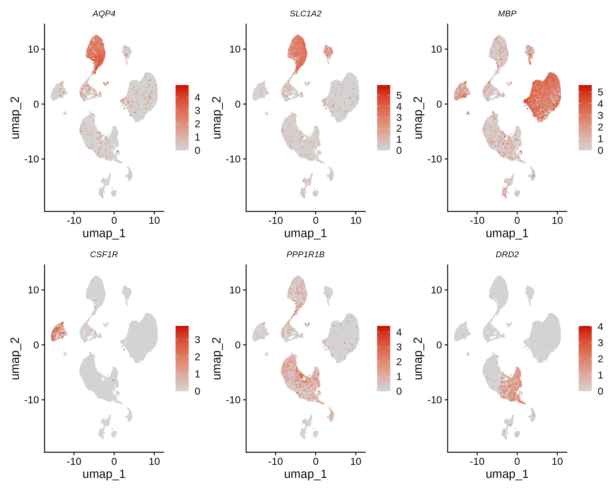
La grafica demuestra que en efecto, los clusters siguen expresan los marcadores previamente anotados en literatura.

------------------------------------------------------------------------

# Fase 4 · Marcadores por Cluster (`markers_results/`)
> Esta fase, es importante para extraer los genes que caracterizan la identidad de cada cluster utilizando la funcion `FindAllMarkers()`

## FindAllMarkers

```{r}
#| label: find-markers

DefaultAssay(alldata) <- "RNA"

alldata <- JoinLayers(alldata)

markers_genes <- FindAllMarkers(
  alldata,
  log2FC.threshold    = 0.2,
  test.use            = "wilcox",
  min.pct             = 0.1,
  min.diff.pct        = 0.2,
  only.pos            = TRUE,
  max.cells.per.ident = 50,
  assay               = "RNA"
)

# Guardar todos los marcadores
write.csv(markers_genes, "markers_results/all_markers_by_cluster.csv", row.names = FALSE)

# Top 5 por cluster
top5 <- markers_genes %>%
  group_by(cluster) %>%
  slice_min(p_val_adj, n = 5, with_ties = FALSE)

write.csv(top5, "markers_results/top5_markers_by_cluster.csv", row.names = FALSE)

# Tabla interactiva
DT::datatable(
  markers_genes %>%
    filter(avg_log2FC > 1) %>%
    group_by(cluster) %>%
    slice_head(n = 5),
  options = list(pageLength = 10),
  caption = "Top marcadores por cluster (avg_log2FC > 1)"
)
```

## Heatmap de Marcadores

```{r}
#| label: heatmap-markers
#| fig-cap: "Heatmap top 5 marcadores por cluster"

alldata_top5 <- ScaleData(alldata,
                          features = as.character(unique(top5$gene)),
                          assay    = "RNA")

DoHeatmap(
  alldata_top5,
  features = as.character(unique(top5$gene)),
  group.by = sel.clust,
  assay    = "RNA"
) +
  theme(axis.text.y = element_text(size = 5))
ggsave("markers_results/Heatmap.jpeg", width = 10, height = 8, dpi = 300)

```

Esta grafica representa los niveles de expresion de cada cluster empezando por el mas grande hasta el mas chico, el color amarillo representa niveles altos de expresion y el violeta niveles bajos.

## DotPlot de Marcadores

```{r}
#| label: dotplot-markers
#| fig-cap: "DotPlot marcadores por cluster"

DotPlot(
  alldata_top5,
  features  = rev(as.character(unique(top5$gene))),
  group.by  = sel.clust,
  assay     = "RNA",
  dot.scale = 5
) +
  coord_flip() +
  scale_color_gradient2(low = "#4B7FBE", mid = "white", high = "#E05C4B", midpoint = 0) +
  labs(x = NULL, y = "Cluster") +
  theme_classic(base_size = 9) +
  theme(axis.text.x = element_text(angle = 45, hjust = 1),
        axis.text.y = element_text(face = "italic", size = 6))

ggsave("markers_results/Dotplot.jpeg", width = 10, height = 8, dpi = 300)
```

Es una grafica similar a la anterior, pero en lugar de que cada columna sea una celula, ahora se colapsa en un punto y el tamaño del punto nos indica que proporcion de celulas expresa ese gen.

## Control del Ciclo Celular (Diagnóstico)

> \[ ATENCIÓN METODOLÓGICA: Remoción de la Regresión del Ciclo \]
>
> Conservamos tu bloque para visualizar las firmas G2M/S (que biológicamente aquí representan estrés oxidativo y reparación de ADN), pero **ELIMINAMOS la función `ScaleData(vars.to.regress = c("S.Score", "G2M.Score"))`**. Regresar estas puntuaciones nivelaría a las células enfermas con el grupo de control.

```{r}
s.genes <- cc.genes.updated.2019$s.genes
g2m.genes <- cc.genes.updated.2019$g2m.genes

neuro_annotated <- CellCycleScoring(neuro_annotated,
                                    s.features = s.genes,
                                    g2m.features = g2m.genes,
                                    set.ident = FALSE) # No alteramos el Ident activo

# Observando Oligodendrocitos estresados
oligo <- subset(neuro_annotated, subset = celltype_azimuth == "Oligodendrocyte")

VlnPlot(oligo, features = c("S.Score", "G2M.Score"), group.by = "condition", pt.size = 0) +
  ggtitle("Firmas G2M/S en Oligodendrocitos por Condición (Reparación ADN)")

ggsave("markers_results/CC_Violin.jpeg", width = 10, height = 8, dpi = 300)

# NO SE EJECUTA ESTO EN EL CEREBRO ESTRIADO PATOLÓGICO:
# seurat_obj <- ScaleData(neuro_annotated, vars.to.regress = c("S.Score", "G2M.Score"))

```

------------------------------------------------------------------------

# Fase 5 · Expresión Diferencial (`DEG_results/`)
En esta fase buscamos identificar qué genes cambian significativamente su nivel de expresión entre las condiciones clínicas (Alzheimer [AD], Parkinson [PD] y Control [CTRL]), analizando cada tipo celular por separado mediante la prueba no paramétrica de Wilcoxon.

## Wilcoxon por Tipo Celular

## Expresión Diferencial: AD vs PD vs Control

> \[ 🛠️ CORRECCIÓN METODOLÓGICA: Inferencia No Paramétrica Individual \]
>
> La metodología oficial empleó contrastes directos iterativos bajo distribuciones de suma de rangos de Wilcoxon para conservar los perfiles.

```{r}
# Configurar ambiente
DefaultAssay(neuro_annotated) <- "RNA"
Idents(neuro_annotated) <- "celltype_azimuth"

# Tipos celulares válidos
valid_celltypes <- names(table(neuro_annotated$celltype_azimuth))[
  table(neuro_annotated$celltype_azimuth) >= 50 &
  !names(table(neuro_annotated$celltype_azimuth)) %in% c("False", "Splatter neuron")
]

# Función estricta para Wilcoxon por tipo celular y contraste
run_de_wilcox <- function(obj, celltype_name) {
  
  sub <- subset(obj, idents = celltype_name)
  cat("\n── ", celltype_name, " · ", ncol(sub), " células\n")
  
  if (any(table(sub$condition) < 10)) return(NULL)
  Idents(sub) <- "condition"
  
  # Contrastes base con logfc empírico (logfc.threshold = 0.25)
  de_AD <- tryCatch(FindMarkers(sub, ident.1 = "AD", ident.2 = "CTRL",
                                test.use = "wilcox", logfc.threshold = 0.25, min.pct = 0.2, assay = "RNA"),
                    error = function(e) NULL)
  
  de_PD <- tryCatch(FindMarkers(sub, ident.1 = "PD", ident.2 = "CTRL",
                                test.use = "wilcox", logfc.threshold = 0.25, min.pct = 0.2, assay = "RNA"),
                    error = function(e) NULL)
  
  de_ADvsPD <- tryCatch(FindMarkers(sub, ident.1 = "AD", ident.2 = "PD",
                                    test.use = "wilcox", logfc.threshold = 0.25, min.pct = 0.2, assay = "RNA"),
                        error = function(e) NULL)
  
  res_list <- list()
  if (!is.null(de_AD)) { de_AD$gene <- rownames(de_AD); de_AD$contrast <- "AD_vs_Ctrl"; de_AD$celltype <- celltype_name; res_list[[1]] <- de_AD }
  if (!is.null(de_PD)) { de_PD$gene <- rownames(de_PD); de_PD$contrast <- "PD_vs_Ctrl"; de_PD$celltype <- celltype_name; res_list[[2]] <- de_PD }
  if (!is.null(de_ADvsPD)) { de_ADvsPD$gene <- rownames(de_ADvsPD); de_ADvsPD$contrast <- "AD_vs_PD"; de_ADvsPD$celltype <- celltype_name; res_list[[3]] <- de_ADvsPD }
  
  bind_rows(res_list)
}

# Correr sobre todo el dataset validado
de_results <- lapply(valid_celltypes, function(ct) run_de_wilcox(neuro_annotated, ct))
de_all <- bind_rows(de_results)

# Diagnóstico general
de_all %>%
  filter(p_val_adj < 0.05) %>%
  group_by(celltype, contrast) %>%
  summarise(n_DEG = n(), .groups = "drop") %>%
  arrange(desc(n_DEG)) %>%
  print(n = 20)

saveRDS(de_all, file = "DEG_results/de_all.rds")

```

En este paso lo que hicimos fue activar la matriz de datos crudos/normalizados de RNA y establece las identidades celulares calculadas previamente por el mapa de referencia. 
Una vez teniendo la matriz genera una lista con los tipos celulares que tengan un minimo de 50 células.
Después se cera una funcion (run_de_wilcox) para extaer el subjunto de datos para un tipo celular en específico. luego de manera secuencial se ejecuta la funcion FindMarkers de Seurat para 3 contrastes:

- AD vs CTRL
- PS vs CTRL
- AD vs PD 

Los umbrales que usamos fueron:
- Umbral de cambio minimo -> 0.25
- Expresión del gen al menos al menos a 20% de las células (min.pct=0.2) 


```{r}
#| label: de-wilcox 1

de_all <- readRDS("DEG_results/de_all.rds")

# Guardar resultados completos
write.csv(de_all, "DEG_results/DEG_wilcox_all_celltypes.csv", row.names = FALSE)

# Guardar por contraste
for (ct in unique(de_all$contrast)) {
  df_ct <- de_all %>% filter(contrast == ct, p_val_adj < 0.05, abs(avg_log2FC) > 0.5)
  write.csv(df_ct,
            paste0("DEG_results/DEG_sig_", ct, ".csv"),
            row.names = FALSE)
}

# Resumen
de_summary <- de_all %>%
  filter(p_val_adj < 0.05, abs(avg_log2FC) > 0.5,
         !celltype %in% c("False", "Splatter neuron")) %>%
  group_by(celltype, contrast) %>%
  summarise(n_DEG = n(), .groups = "drop") %>%
  arrange(desc(n_DEG))

knitr::kable(de_summary, caption = "DEGs significativos por tipo celular y contraste")
```

En esta parte se busca agrupar los resultados por tipo celular y contraste para renderizar en una tabla. 

## Función Volcano Plot
En esta parte buscamos calcular el valor p mínimo diferente de cero para evitar errores matemáticos de $-\log_{10}(0)$ en el eje Y. Clasifica los genes en tres categorías cromáticas y estadísticas: Up (Rojo, sobreexpresados), Down (Azul, subexpresados) y NS (Gris, no significativos).

También esxcluye de las etiquetas de texto los ARN no codificantes flotantes o pseudogenes (como los que inician con AC[0-9], AL[0-9], LINC, etc.) para evitar saturar el gráfico con ruido genómico y priorizar genes con codificación de proteína real. Usa geom_text_repel para separar dinámicamente los nombres de los genes más importantes.

```{r}
#| label: volcano-function

volcano_seurat <- function(df, title, fc_cut = 0.5, p_cut = 0.05, n_label = 15) {
  if (nrow(df) == 0) return(ggplot() + labs(title = paste(title, "· sin datos")))

  min_p <- min(df$p_val_adj[df$p_val_adj > 0], na.rm = TRUE)

  df <- df %>%
    mutate(
      p_plot    = ifelse(p_val_adj == 0, min_p, p_val_adj),
      direction = case_when(
        p_val_adj < p_cut & avg_log2FC >  fc_cut ~ "Up",
        p_val_adj < p_cut & avg_log2FC < -fc_cut ~ "Down",
        TRUE ~ "NS"
      )
    )

  n_up   <- sum(df$direction == "Up")
  n_down <- sum(df$direction == "Down")

  to_label <- bind_rows(
    df %>% filter(direction == "Up")   %>% arrange(p_plot, desc(avg_log2FC)) %>% head(n_label),
    df %>% filter(direction == "Down") %>% arrange(p_plot, avg_log2FC)       %>% head(n_label)
  ) %>% filter(!grepl("^AC[0-9]|^AL[0-9]|^LINC|-AS[0-9]", gene))

  ggplot(df, aes(avg_log2FC, -log10(p_plot), color = direction)) +
    geom_point(aes(alpha = direction), size = 0.8) +
    scale_alpha_manual(values = c("NS" = 0.15, "Up" = 0.8, "Down" = 0.8), guide = "none") +
    scale_color_manual(
      values = c("NS" = "grey75", "Up" = "#E05C4B", "Down" = "#4B7FBE"),
      labels = c(
        "NS"   = "NS",
        "Up"   = paste0("Up (", n_up, ")"),
        "Down" = paste0("Down (", n_down, ")")
      )
    ) +
    geom_vline(xintercept = c(-fc_cut, fc_cut),
               linetype = "dashed", color = "grey40", linewidth = 0.4) +
    geom_hline(yintercept = -log10(p_cut),
               linetype = "dashed", color = "grey40", linewidth = 0.4) +
    geom_text_repel(data = to_label, aes(label = gene),
                    color = "black", size = 2.5, fontface = "italic",
                    max.overlaps = 20, segment.color = "grey60") +
    scale_x_continuous(limits = c(-4, 4), oob = squish) +
    labs(
      title    = title,
      subtitle = paste0("|log2FC| > ", fc_cut, "  ·  FDR < ", p_cut),
      x = "avg log2FC", y = expression(-log[10](FDR)),
      color = NULL
    ) +
    theme_classic(base_size = 11) +
    theme(
      plot.title      = element_text(face = "bold", size = 12),
      plot.subtitle   = element_text(color = "grey50", size = 8),
      legend.position = "top"
    )
}
```

## Volcano Plots por Tipo Celular

Aquí filtran los datos genomicos masivos para aislar el linaje correspondiente.s

```{r}
#| label: volcano-microglia
#| fig-cap: "Volcano · Microglia"

wrap_plots(
  volcano_seurat(de_all %>% filter(celltype == "Microglia", contrast == "AD_vs_Ctrl"),
                 "Microglia · AD vs Control"),
  volcano_seurat(de_all %>% filter(celltype == "Microglia", contrast == "PD_vs_Ctrl"),
                 "Microglia · PD vs Control"),
  volcano_seurat(de_all %>% filter(celltype == "Microglia", contrast == "AD_vs_PD"),
                 "Microglia · AD vs PD"),
  ncol = 3
)
ggsave("DEG_results/DEGVolc_Microglia.jpeg", width = 10, height = 8, dpi = 300)

```


```{r}
#| label: volcano-oligodendrocyte
#| fig-cap: "Volcano · Oligodendrocyte"

wrap_plots(
  volcano_seurat(de_all %>% filter(celltype == "Oligodendrocyte", contrast == "AD_vs_Ctrl"),
                 "Oligodendrocyte · AD vs Control"),
  volcano_seurat(de_all %>% filter(celltype == "Oligodendrocyte", contrast == "PD_vs_Ctrl"),
                 "Oligodendrocyte · PD vs Control"),
  volcano_seurat(de_all %>% filter(celltype == "Oligodendrocyte", contrast == "AD_vs_PD"),
                 "Oligodendrocyte · AD vs PD"),
  ncol = 3
)
ggsave("DEG_results/DEGVolc_Oligodendrocyte.jpeg", width = 10, height = 8, dpi = 300)

```

```{r}
#| label: volcano-astrocyte
#| fig-cap: "Volcano · Astrocyte"

wrap_plots(
  volcano_seurat(de_all %>% filter(celltype == "Astrocyte", contrast == "AD_vs_Ctrl"),
                 "Astrocyte · AD vs Control"),
  volcano_seurat(de_all %>% filter(celltype == "Astrocyte", contrast == "PD_vs_Ctrl"),
                 "Astrocyte · PD vs Control"),
  volcano_seurat(de_all %>% filter(celltype == "Astrocyte", contrast == "AD_vs_PD"),
                 "Astrocyte · AD vs PD"),
  ncol = 3
)
ggsave("DEG_results/DEGVolc_Astrocyte.jpeg", width = 10, height = 8, dpi = 300)

```

```{r}
#| label: volcano-msn
#| fig-cap: "Volcano · D1 Medium Spiny Neuron"

wrap_plots(
  volcano_seurat(de_all %>% filter(celltype == "D1 medium spiny neuron", contrast == "AD_vs_Ctrl"),
                 "D1 MSN · AD vs Control"),
  volcano_seurat(de_all %>% filter(celltype == "D1 medium spiny neuron", contrast == "PD_vs_Ctrl"),
                 "D1 MSN · PD vs Control"),
  volcano_seurat(de_all %>% filter(celltype == "D1 medium spiny neuron", contrast == "AD_vs_PD"),
                 "D1 MSN · AD vs PD"),
  ncol = 3
)
ggsave("DEG_results/DEGVolc_D1MSN.jpeg", width = 10, height = 8, dpi = 300)

```


## Resumen DEGs (Barplot)

Generamos un gráfico de barras bidireccional (espejo o torniquete). Cuenta cuántos genes se regularon al alza (Up) y cuántos a la baja (Down) bajo el filtro $|log_2FC| > 0.5$. Los valores "Down" se transforman en números negativos (-n) de manera artificial para que las barras se proyecten hacia el lado izquierdo y las barras "Up" hacia la derecha tras aplicar coord_flip(). Divide el gráfico en paneles según el contraste clínico (facet_wrap).

```{r}
#| label: deg-barplot
#| fig-cap: "Número de DEGs por tipo celular y contraste"

deg_bar <- de_all %>%
  filter(p_val_adj < 0.05, abs(avg_log2FC) > 0.5,
         !celltype %in% c("False", "Splatter neuron")) %>%
  mutate(direction = ifelse(avg_log2FC > 0, "Up", "Down")) %>%
  group_by(celltype, contrast, direction) %>%
  summarise(n = n(), .groups = "drop") %>%
  mutate(
    n_plot   = ifelse(direction == "Down", -n, n),
    contrast = factor(contrast,
                      levels = c("AD_vs_Ctrl", "PD_vs_Ctrl", "AD_vs_PD"),
                      labels = c("AD vs Control", "PD vs Control", "AD vs PD"))
  )

ggplot(deg_bar, aes(x = celltype, y = n_plot, fill = direction)) +
  geom_bar(stat = "identity") +
  geom_hline(yintercept = 0, linewidth = 0.3) +
  facet_wrap(~ contrast, ncol = 1) +
  scale_fill_manual(values = c("Up" = "#E05C4B", "Down" = "#4B7FBE"), name = NULL) +
  scale_y_continuous(labels = abs) +
  coord_flip() +
  labs(title = "DEGs por tipo celular", x = NULL, y = "N genes (Up / Down)") +
  theme_classic(base_size = 11) +
  theme(plot.title   = element_text(face = "bold"),
        strip.text   = element_text(face = "bold"),
        legend.position = "top")
ggsave("DEG_results/DEG_barplot.jpeg", width = 10, height = 8, dpi = 300)
```

## Heatmap DEGs

Selccionamos los 5 gens mas alterados (por valor absoluto de $log_2FC$) para cada contraste y tipo celular.

```{r}
#| label: heatmap-degs
#| fig-cap: "Heatmap de DEGs significativos"

top_genes_hm <- de_all %>%
  filter(p_val_adj < 0.05, abs(avg_log2FC) > 0.5,
         !grepl("^AC[0-9]|^AL[0-9]|^LINC|^MIR|-AS[0-9]", gene)) %>%
  group_by(contrast, celltype) %>%
  slice_max(abs(avg_log2FC), n = 5, with_ties = FALSE) %>%
  pull(gene) %>% unique()

top_genes_hm <- top_genes_hm[top_genes_hm %in% rownames(neuro_annotated)]

avg_expr <- AverageExpression(
  neuro_annotated,
  features = top_genes_hm,
  group.by = "condition",
  assay    = "RNA",
  layer    = "data"
)$RNA

mat_hm <- t(scale(t(avg_expr)))[, c("CTRL", "AD", "PD")]

col_anno <- HeatmapAnnotation(
  Condition = c("CTRL", "AD", "PD"),
  col       = list(Condition = pal_condition),
  annotation_name_side = "left"
)

png(filename = "DEG_results/Heatmap.jpeg", width = 8, height = 8, units = "in", res = 300)

ht <- Heatmap(
  mat_hm,
  name               = "Z-score",
  col                = colorRamp2(c(-2, 0, 2), c("#4B7FBE", "white", "#E05C4B")),
  top_annotation     = col_anno,
  show_row_names     = TRUE,
  show_column_names  = TRUE,
  row_names_gp       = gpar(fontsize = 7, fontface = "italic"),
  column_names_gp    = gpar(fontsize = 11, fontface = "bold"),
  cluster_columns    = FALSE,
  cluster_rows       = TRUE,
  column_title       = "DEGs · AD / CTRL / PD",
  column_title_gp    = gpar(fontsize = 12, fontface = "bold")
)
draw(ht)

dev.off()

```

---

# Fase 6 · GO Terms (`DEG_results/`)
En esta fase tenemos la interpretación biológica. buscamos los procesos biológicos o rutas metabolicas de genes encontrados

## Preparación del Universo Génico

```{r}
#| label: go-universe

universe_entrez <- bitr(unique(de_all$gene),
                        fromType = "SYMBOL",
                        toType   = "ENTREZID",
                        OrgDb    = org.Hs.eg.db)
cat("Genes en el universo:", nrow(universe_entrez), "\n")
```

## Función GO Enrichment

```{r}
#| label: go-function

run_GO <- function(genes, universe_entrez, ont = "BP") {
  genes_clean <- genes[!grepl("^AC[0-9]|^AL[0-9]|^LINC|-AS[0-9]|\\.", genes)]
  if (length(genes_clean) < 5) return(NULL)

  gene_entrez <- bitr(genes_clean, fromType = "SYMBOL",
                      toType = "ENTREZID", OrgDb = org.Hs.eg.db)
  if (nrow(gene_entrez) < 5) return(NULL)

  ego <- enrichGO(
    gene          = gene_entrez$ENTREZID,
    universe      = universe_entrez$ENTREZID,
    OrgDb         = org.Hs.eg.db,
    ont           = ont,
    pAdjustMethod = "BH",
    pvalueCutoff  = 0.05,
    qvalueCutoff  = 0.2,
    readable      = TRUE
  )
  if (is.null(ego) || nrow(ego@result) == 0) return(NULL)
  simplify(ego, cutoff = 0.7, by = "p.adjust", select_fun = min)
}
```

## GO por Tipo Celular × Condición × Dirección

```{r}
#| label: go-all

celltypes_go <- c("Astrocyte", "Microglia",
                  "Oligodendrocyte", "D1 medium spiny neuron")

go_all <- list()

for (ct in celltypes_go) {
  for (contr in c("AD_vs_Ctrl", "PD_vs_Ctrl")) {
    for (dir in c("Up", "Down")) {
      fc_filter <- if (dir == "Up") quote(avg_log2FC > 0.25) else quote(avg_log2FC < -0.25)
      genes <- de_all %>%
        filter(celltype == ct, contrast == contr, p_val_adj < 0.05, !!fc_filter) %>%
        pull(gene)

      key <- paste(ct, contr, dir, sep = "__")
      cat(key, "·", length(genes), "genes\n")
      go_all[[key]] <- run_GO(genes, universe_entrez)
    }
  }
}

# Guardar resultados GO en CSV
go_export <- bind_rows(lapply(names(go_all), function(key) {
  ego <- go_all[[key]]
  if (is.null(ego)) return(NULL)
  parts <- str_split(key, "__")[[1]]
  ego@result %>%
    filter(p.adjust < 0.05) %>%
    mutate(celltype = parts[1], contrast = parts[2], direction = parts[3])
}))

if (nrow(go_export) > 0) {
  write.csv(go_export, "DEG_results/GO_enrichment_results.csv", row.names = FALSE)
  cat("Términos GO significativos:", nrow(go_export), "\n")
}
```

## Dotplot GO 
```{r}
#| label: go-dotplot
#| fig-cap: "GO Terms por tipo celular y condición"
#| fig-height: 11

ct_labels <- c(
  "Astrocyte"              = "Ast",
  "Microglia"              = "Mic",
  "Oligodendrocyte"        = "Oli",
  "D1 medium spiny neuron" = "MSN"
)

go_df <- bind_rows(lapply(names(go_all), function(key) {
  ego <- go_all[[key]]
  if (is.null(ego) || nrow(ego@result) == 0) return(NULL)
  parts <- str_split(key, "__")[[1]]
  ego@result %>%
    arrange(p.adjust) %>%
    slice_head(n = 3) %>%
    transmute(
      Description,
      Count,
      p.adjust,
      GeneRatio_num = sapply(GeneRatio, function(x) {
        v <- as.numeric(str_split(x, "/")[[1]]); v[1] / v[2]
      }),
      celltype  = parts[1],
      condition = ifelse(str_detect(parts[2], "^AD"), "AD", "PD"),
      direction = parts[3]
    )
}))

if (nrow(go_df) > 0) {
  top_terms <- go_df %>%
    group_by(Description) %>%
    summarise(n_groups = n(), min_padj = min(p.adjust), .groups = "drop") %>%
    arrange(desc(n_groups), min_padj) %>%
    slice_head(n = 40) %>%
    pull(Description)

  plot_df <- go_df %>%
    filter(Description %in% top_terms, celltype %in% celltypes_go) %>%
    mutate(
      Description    = factor(Description, levels = rev(top_terms)),
      celltype_short = factor(ct_labels[celltype], levels = ct_labels),
      condition      = factor(condition, levels = c("AD", "PD")),
      direction      = factor(direction, levels = c("Up", "Down"))
    )

  ggplot(plot_df, aes(x = condition, y = Description)) +
    facet_nested(
      . ~ direction + celltype_short,
      scales = "free_x", space = "free_x"
    ) +
    geom_point(aes(size = GeneRatio_num, color = p.adjust)) +
    scale_color_gradient(
      low   = "#CC0000", high = "#AAAAFF",
      name  = "p.adjust",
      guide = guide_colorbar(reverse = TRUE, barwidth = 0.8, barheight = 5)
    ) +
    scale_size_continuous(range = c(2, 8), name = "GeneRatio",
                          breaks = c(0.1, 0.2, 0.3, 0.4)) +
    labs(
      title    = "Top GO Biological Process",
      subtitle = "Putamen · AD & PD vs Control · estilo Xu et al. 2023",
      x = NULL, y = NULL
    ) +
    theme_bw(base_size = 10) +
    theme(
      plot.title       = element_text(face = "bold", size = 13),
      plot.subtitle    = element_text(color = "grey50", size = 9),
      axis.text.x      = element_text(angle = 45, hjust = 1, size = 9, face = "bold"),
      axis.text.y      = element_text(size = 8),
      strip.text       = element_text(face = "bold", size = 9),
      panel.grid.major = element_line(color = "grey92", linewidth = 0.3),
      legend.position  = "left"
    )
} else {
  cat("Sin términos GO significativos para graficar.\n")
}
ggsave("DEG_results/TopGO_DOT.jpeg", width = 10, height = 8, dpi = 300)

```

## CompareCluster GO (Astrocitos)

```{r}
#| label: go-compare
#| fig-cap: "Comparación GO entre contrastes · Astrocitos"

gene_list_astro <- list()

for (contr in c("AD_vs_Ctrl", "PD_vs_Ctrl")) {
  for (dir in c("Up", "Down")) {
    fc_f  <- if (dir == "Up") quote(avg_log2FC > 0.25) else quote(avg_log2FC < -0.25)
    genes <- de_all %>%
      filter(celltype == "Astrocyte", contrast == contr,
             p_val_adj < 0.05, !!fc_f) %>%
      pull(gene)

    if (length(genes) >= 5) {
      entrez <- bitr(genes, fromType = "SYMBOL",
                     toType = "ENTREZID", OrgDb = org.Hs.eg.db)
      if (nrow(entrez) >= 5) {
        label <- paste0(ifelse(contr == "AD_vs_Ctrl", "AD", "PD"), " (", dir, ")")
        gene_list_astro[[label]] <- entrez$ENTREZID
      }
    }
  }
}

if (length(gene_list_astro) >= 2) {
  ck_astro <- compareCluster(
    geneClusters  = gene_list_astro,
    fun           = "enrichGO",
    universe      = universe_entrez$ENTREZID,
    OrgDb         = org.Hs.eg.db,
    ont           = "BP",
    pAdjustMethod = "BH",
    pvalueCutoff  = 0.05,
    readable      = TRUE
  )
  ck_astro <- simplify(ck_astro, cutoff = 0.7)

  dotplot(ck_astro, showCategory = 10,
          title = "GO Biological Process · Astrocitos · AD & PD vs Control") +
    theme(
      axis.text.x = element_text(angle = 45, hjust = 1, size = 9),
      axis.text.y = element_text(size = 8),
      plot.title  = element_text(face = "bold")
    )
  ggsave("DEG_results/ADPD_CTRLAstro.jpeg", width = 10, height = 8, dpi = 300)

  # Guardar tabla
  write.csv(as.data.frame(ck_astro),
            "DEG_results/GO_compareCluster_Astrocytes.csv",
            row.names = FALSE)
} else {
  cat("Insuficientes grupos para compareCluster.\n")
}
```

## KEGG Pathways (Astrocitos)

```{r}
#| label: kegg-compare
#| fig-cap: "Vías KEGG · Astrocitos"

if (length(gene_list_astro) >= 2) {
  ck_kegg <- compareCluster(
    geneClusters  = gene_list_astro,
    fun           = "enrichKEGG",
    organism      = "hsa",
    pAdjustMethod = "BH",
    pvalueCutoff  = 0.05
  )

  if (!is.null(ck_kegg) && nrow(ck_kegg@compareClusterResult) > 0) {
    ck_kegg <- setReadable(ck_kegg, OrgDb = org.Hs.eg.db, keyType = "ENTREZID")

    dotplot(ck_kegg, showCategory = 10,
            title = "Vías KEGG · Astrocitos · AD & PD vs Control") +
      scale_color_viridis_c(guide = guide_colorbar(reverse = TRUE)) +
      theme(
        axis.text.x = element_text(angle = 45, hjust = 1, size = 9),
        plot.title  = element_text(face = "bold")
      )
    ggsave("DEG_results/ADPD_CTRLAstro_KEGG.jpeg", width = 10, height = 8, dpi = 300)

    write.csv(as.data.frame(ck_kegg),
              "DEG_results/KEGG_compareCluster_Astrocytes.csv",
              row.names = FALSE)
  } else {
    cat("Sin vías KEGG significativas.\n")
  }
}
```


# Resultados 

## Control de calidad por célula y normalización

Antes de aplicar cualquier filtro de calidad, el dataset combinado de tejido estriatal humano (seurat_obj) presenta las siguientes dimensiones iniciales:

    - Genes totales: 58,288 (filas de la matriz)

    - Células capturadas: 38,929 (columnas de la matriz)

Para separar las células reales del ruido de fondo, aplicamos un doble umbral en el número de genes únicos detectados por célula:


nFeature_RNA > 200 & nFeature_RNA < 2500


### Contaminación Mitocondrial:
Con este umbral, estamos reteniendo células sanas y estables. 

percent_mito < 5


### Expresión Ribosomal:
En este diseño experimental con tejido cerebral post-mortem (human striatal glia), un porcentaje elevado de genes ribosomales suele asociarse a ruido técnico y sesgos de amplificación de la biblioteca.

percent_ribo < 1

Dados los anteriores filtros obtuvimos:

    - Células capturadas: 38,929 -> *12575*

donde estan repartidas por cada condición de la siguiente manera:


## Selección de genes altamente variables

Esta es la lista de los top 10 genes más variables, así como un plot que representa la varianza de cada gen. Esto no fue reportado en el artículo

En cuanto al UMAP, nosotros usamos otro algoritmo para integrar diferente de harmony, llamado SCT. Haciendo esto, nos quedo un UMAP prácticamente identico a aquel en el paper:


Como se puede observar, hay grupos definidos por tipo y subtipo celular, y podemos validarlo aún más con los genes marcadores de tejido: 


Esta es la lista de los genes marcadores para cada uno de los 13 clusters que obtuvimos, al igual que en el paper.


Y finalmente, aquí clusterizamos la expresión de genes más relevantes por cluster, de forma que se observa claramente la diferencia entre cada uno de los 13 clusters.


## Expresión diferencial entre condiciones.

En cuanto a la expresión diferencial, nosotros hicimos 3 comparaciones en el cluster de Astrocitos, Microglía, Oligodendrocitos y Neuronas: AD vs Control, PD vs Control y AD vs PD. En el articulo hicieron estas comparaciones pero solo de patología vs control, y solo para las subpoblaciones de astrocitos que encontraron, por lo cual no puede existir una compración directa más que en el grupo de astrocitos, donde 


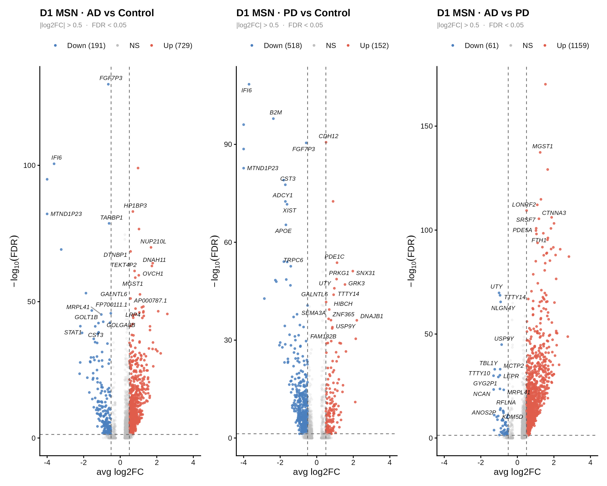

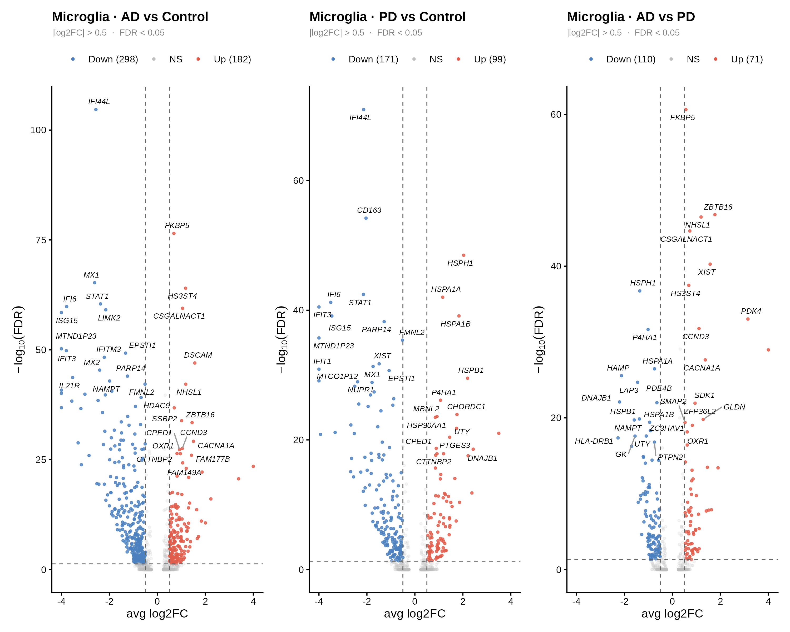

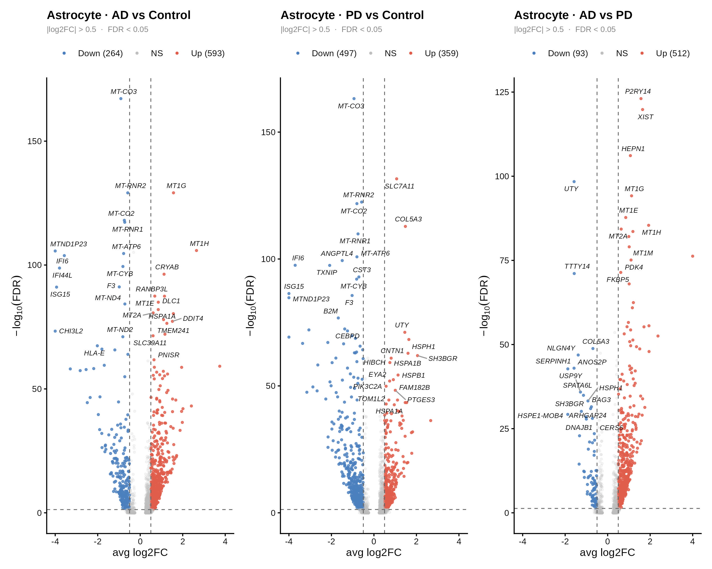

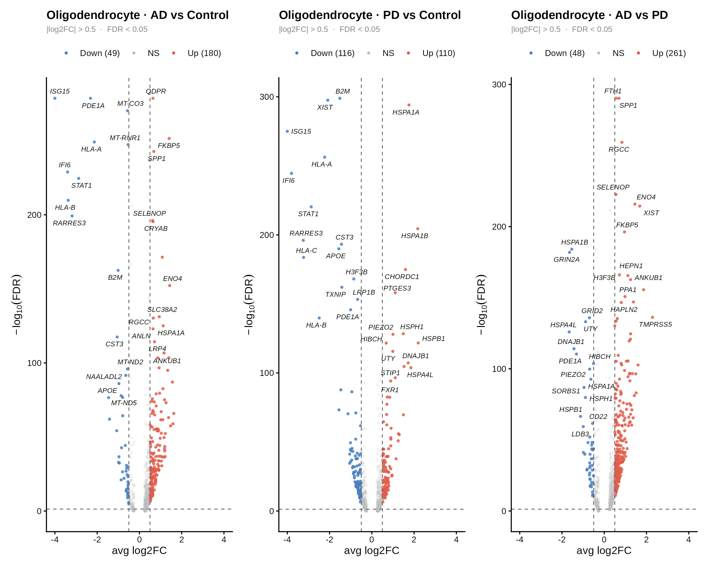


Sin embargo, encontramos resultados diferentes con algunas coincidencias. Las coincidencias en la expresión diferencial del cluster de los astrocitos comparado las condiciones de AD y control es principalmente es que se comparten los genes DDIT4, MT1G, MT1H como sobreexpresados, y los genes IFI44L, IFI6 y F3 como infraexpresados. En el grupo de PD contra control, no hay similitudes en los genes sobreexpresados, pero se comparten los genes APOE y CST3 expresados a la baja.

Por úlimo, también hicimos una figura donde se aprecia claramente la diferencia en expresión de genes entre cada condición y el control, lo cual confirma que hay diferencias signifcativas en los perfiles de expresión

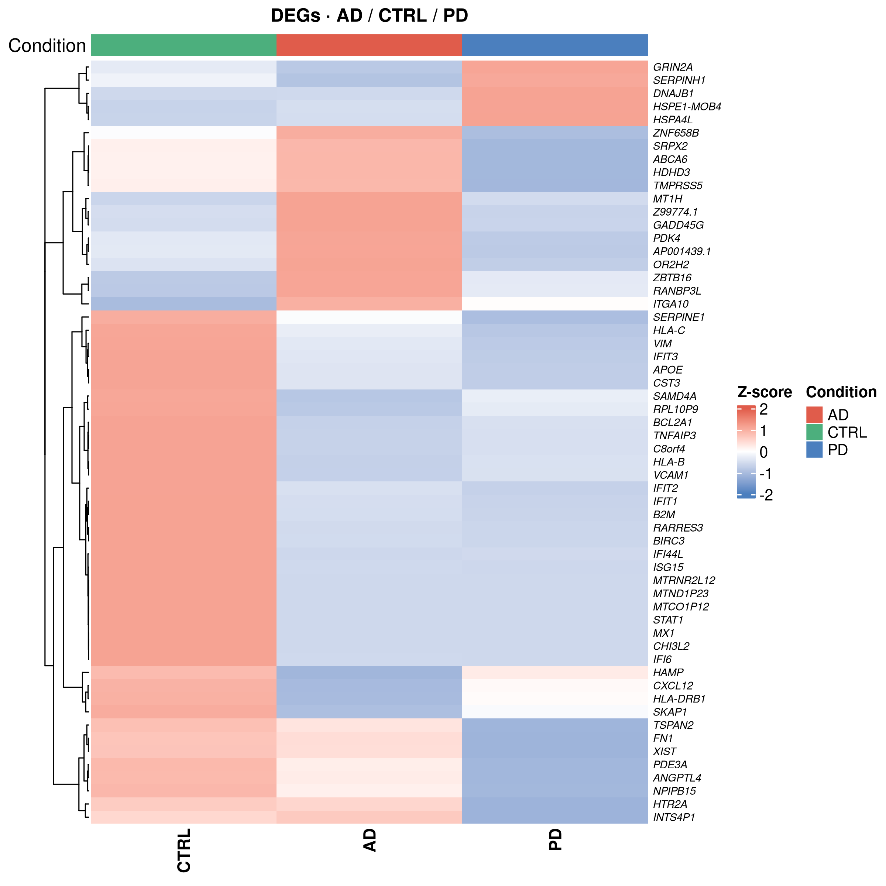

## Enriquecimiento GO y KEGG


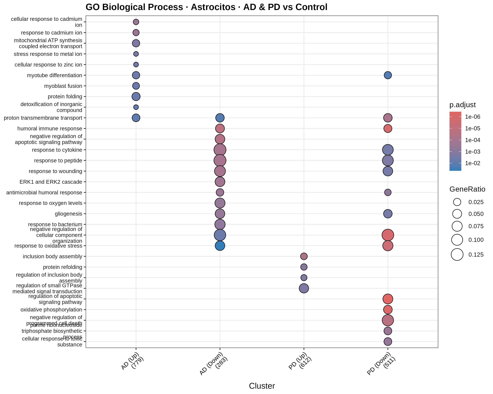

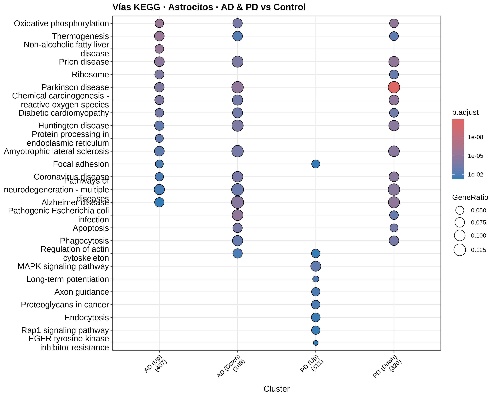


# Discusión


Después de realizar el análisis de clustering no supervisado usando el pipeline descrito anteriormente, obtuvimos resultado muy similares  aquellos encontrados en el artículo del que vienen los datos. 
Es importante mencionar que en el artículo compararon sus resultados entre diferentes zonas del cerebro, mientras que en el BioProject con sus datos solo tenemos la información del putamen, por lo cual nuestro estudio fue limitado.

El UMAP resultante de usar Seurat es muy similar con el del artículo y carece de batch effects, como vimos anteriormente.

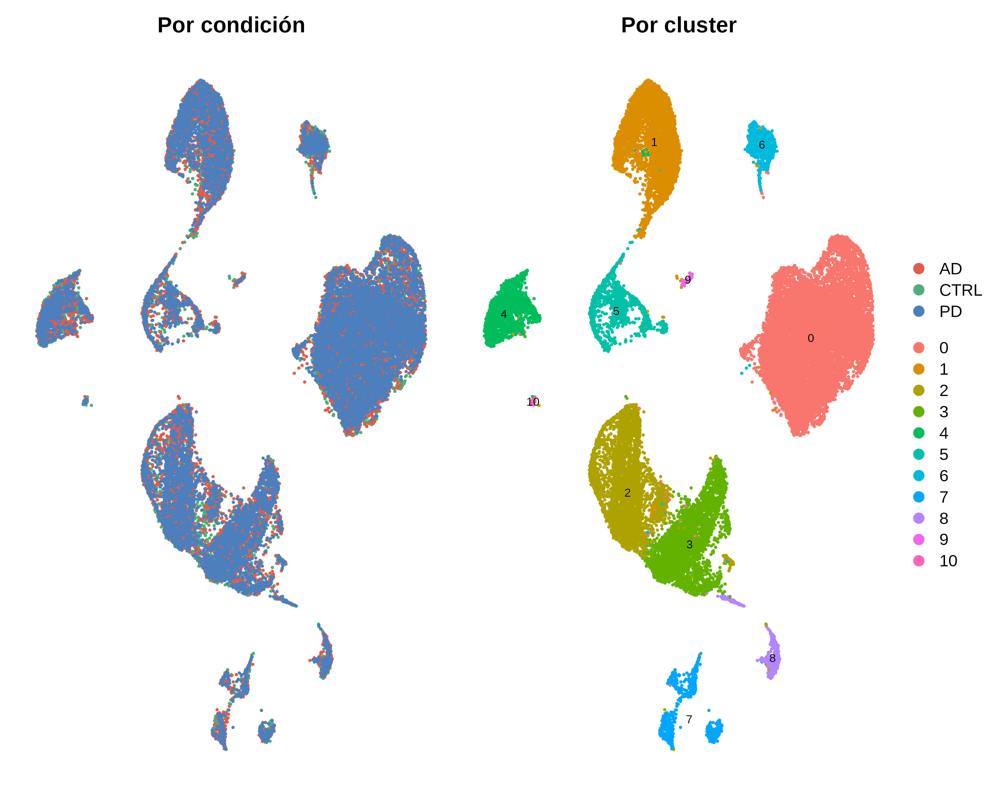

Es verdad que la forma no es exactamente la misma, pero se forman los mismos grupos celulares.

Más aún, también hicimos las gráficas de gradiente de expresión por gen para genes marcadores de cada tipo celular, y los resultados son consistentes y casi iguales a los del artículo.

Sin embargo, nosotros no pudimos identificar los 3 grupos definidos de Astorcitos de los cuales se habla en el artículo, en su lugar, vemos una población heterogénea donde si clasificamos por grupos usando Wilcox test (como en el artículo, por la baja cantidad de núcleos de células), encontramos al menos 5 grupos diferentes, no muy bien definidos. Desconocemos la razón de estos resultados, pero es posible que de deba a la falta de células en nuestros datos (ellos usaron más regiones cerebrales), aunque describen también que estos grupos de forman en todas las regiones cerebrales que estudiaron. 

En cuanto a la expresión diferencial, nosotros hicimos 3 comparaciones en el cluster de Astrocitos: AD vs Control, PD vs Control y AD vs PD. En el articulo hicieron estas comparaciones pero solo de control vs patología, y para cada grupo de astrocito que encontraron, por lo cual no puede existir una compración directa. 

Después, enriquecimos para los terminos biológicos GO para los clusters de Micrglía, Astrocitos y Oligodendrocitos, con los pathways a continuación enriquecidos a la alta y a la baja:

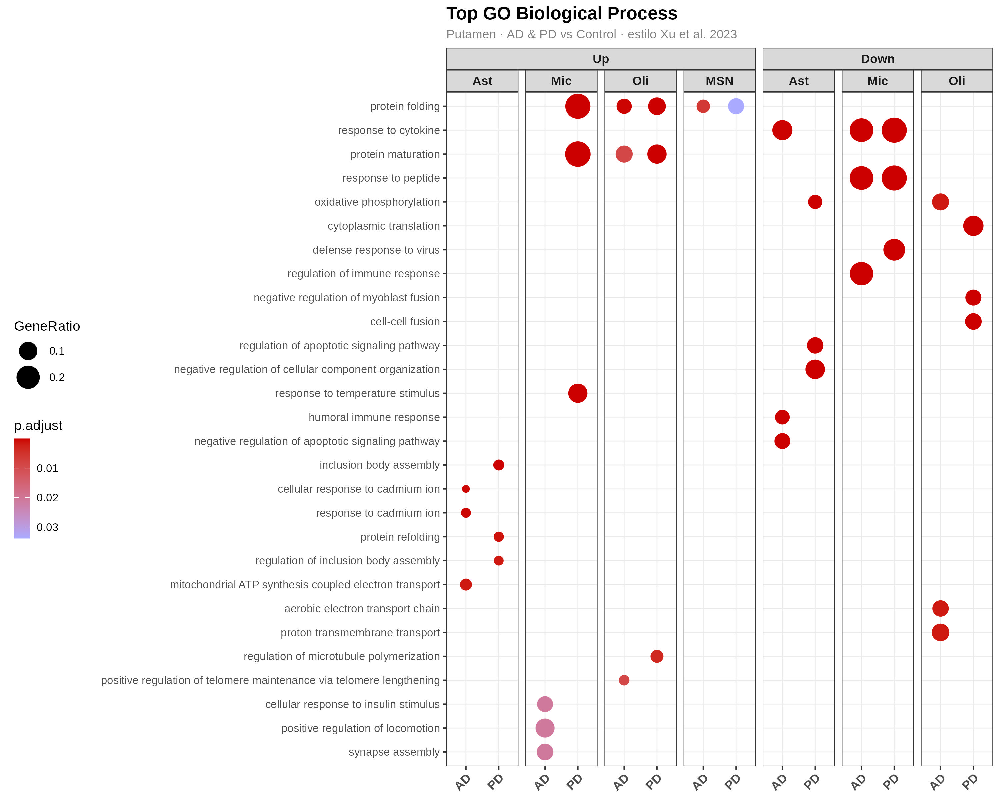

Es importante notar que de nuevo, tenemos pocas vias a la alta y muchas a la baja, mientras que en el artículo es lo contrario. Logramos replicar los pathways a la alta descritos en el artículo en la población de astrocitos relacionados con el metabolismo de metales en la comparación de AD vs control. También fuimos capaces de replicar el hallazgo de las vias KEGG de las poblaciones de astrocitos que describieron a profundidad en el artículo estrechamente relacionadas con Alzheimer, Parkinson y enfermedad de priones. Adicionalmente, muchas de nuestras rutas estaban enfocadas en la apoptosis, el folding de las proteínas y a la detoxificación de compuestos inorgánicos, aparte de las decritas anteriormente del metabolismo de metales. 
En el caso de la microglía, si tuvimos una relación estrecha entre pos pathways de KEGG y la respuesta esperada en la activación de microglía durante el Alzheimer y Parkinson, como pathways a la alta en respuesta a las citoquinas y la apoptosis. 
Es importante notar que se ha propuesto que el cobre tiene una afinidad muy alta con los depositos de proteína beta-amiloide, y que la unión de estos dos librera especies reactivas con el oxígeno, produciendo así estres oxidativo (Yan Zhang et. al, 2023). Por eso es que es un hallazgo importante observar que en los Astrocitos, el pathway involucrado en el metabolismo de Cobre está a la alta.
Otro pathway del metabolismo de metales es aquel del cadmio, un metal pesado altamente tóxico que es muy difícil de expulsar. Varios estudios han sugerido que el cadmio aumenta significativamente el riesgo de padecer alzheimer debido a que aumenta la permeabilidad de la barrera hematoencefálica, y también contribuye a la formación y desposición de placas beta-amiloide, exacerbando la respuesta de la microglía (Jieyi Liu et.al, 2023)


Algo de lo que nos fijamos nosotros que no es tratado en el artículo es el hecho de que la cantidad de oligodendrocitos en lo tejidos del control es menor que en AD y PD, con PD teniendo el mayor numero de estos. Han salido estudios que mencionan que PD podría asociarse con una depleción temprana de oligodendrocitos, o un enriquecimiento de estos pero con funciones alteradas (Jose Maria Salazar Campos et. al, 2025). En nuestro análisis, encontramos que los pathways relacionados con el transporte de ATP e iones transmembranales están a la baja, lo cual podría ser una señal de que los oligodendrocitos no están actuando de forma correcta, lo cual va de la mano con la teoría propuesta por Jose Maria et. al.

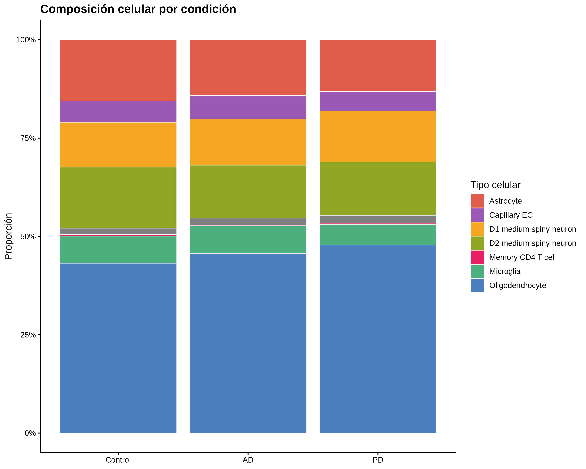

# Referencias

    - Zhang, Y., Yang, Y., Wang, C., Chen, W., Chen, X., Wu, F., & He, H. (2023). Copper metabolism-related Genes in entorhinal cortex for Alzheimer’s disease. Scientific Reports, 13(1), 17458. https://doi.org/10.1038/s41598-023-44656-9
    - Campos, J. M. S., Burbulla, L. F., & Jäkel, S. (2025). Are oligodendrocytes bystanders or drivers of Parkinson’s disease pathology? PLoS Biology, 23(1), e3002977. https://doi.org/10.1371/journal.pbio.3002977
    - Xu, J., Farsad, H. L., Hou, Y., Barclay, K., Lopez, B. A., Yamada, S., Saliu, I. O., Shi, Y., Knight, W. C., Bateman, R. J., Benzinger, T. L. S., Yi, J. J., Li, Q., Wang, T., Perlmutter, J. S., Morris, J. C., & Zhao, G. (2023b). Human striatal glia differentially contribute to AD- and PD-specific neurodegeneration. Nature Aging, 3(3), 346–365. https://doi.org/10.1038/s43587-023-00363-8
    - Grubman, A., Chew, G., Ouyang, J. F., Sun, G., Choo, X. Y., McLean, C., Simmons, R. K., Buckberry, S., Vargas-Landin, D. B., Poppe, D., Pflueger, J., Lister, R., Rackham, O. J. L., Petretto, E., & Polo, J. M. (2019). A single-cell atlas of entorhinal cortex from individuals with Alzheimer’s disease reveals cell-type-specific gene expression regulation. Nature Neuroscience, 22(12), 2087–2097. https://doi.org/10.1038/s41593-019-0539-4

    - Liu, J., Xie, Y., Lu, Y., Zhao, Z., Zhuang, Z., Yang, L., Huang, H., Li, H., Mao, Z., Pi, S., Chen, F., & He, Y. (2023). APP/PS1 Gene-Environmental cadmium interaction aggravates the progression of Alzheimer’s disease in mice via the Blood-Brain barrier, amyloid-Β, and inflammation. Journal of Alzheimer S Disease, 94(1), 115–136. https://doi.org/10.3233/jad-221205
    
# Resumen de Archivos Generados

```{r}
#| label: resumen-archivos

cat("=== QC_results/ ===\n")
list.files("QC_results/")

cat("\n=== seurat_objects/ ===\n")
list.files("seurat_objects/")

cat("\n=== clustering_results/ ===\n")
list.files("clustering_results/")

cat("\n=== markers_results/ ===\n")
list.files("markers_results/")

cat("\n=== DEG_results/ ===\n")
list.files("DEG_results/")
```

------------------------------------------------------------------------

# Información de Sesión

```{r}
#| label: session

sessionInfo()
```

```         
R version 4.6.0 (2026-04-24)
Platform: x86_64-pc-linux-gnu
Running under: CachyOS

Matrix products: default
BLAS:   /usr/lib/libblas.so.3.12.0 
LAPACK: /usr/lib/liblapack.so.3.12.0  LAPACK version 3.12.0

locale:
 [1] LC_CTYPE=es_MX.UTF-8       LC_NUMERIC=C               LC_TIME=es_MX.UTF-8       
 [4] LC_COLLATE=es_MX.UTF-8     LC_MONETARY=es_MX.UTF-8    LC_MESSAGES=es_MX.UTF-8   
 [7] LC_PAPER=es_MX.UTF-8       LC_NAME=C                  LC_ADDRESS=C              
[10] LC_TELEPHONE=C             LC_MEASUREMENT=es_MX.UTF-8 LC_IDENTIFICATION=C       

time zone: America/Mexico_City
tzcode source: system (glibc)

attached base packages:
[1] stats4    grid      stats     graphics  grDevices utils     datasets  methods   base     

other attached packages:
 [1] AzimuthAPI_0.2.0       future_1.70.0          metap_1.14             zellkonverter_1.22.0  
 [5] DoubletFinder_2.0.6    ggh4x_0.3.1            enrichplot_1.32.0      org.Hs.eg.db_3.23.1   
 [9] AnnotationDbi_1.74.0   IRanges_2.46.0         S4Vectors_0.50.1       clusterProfiler_4.20.0
[13] circlize_0.4.18        ComplexHeatmap_2.28.0  scales_1.4.0           viridis_0.6.5         
[17] viridisLite_0.4.3      RColorBrewer_1.1-3     ggrepel_0.9.8          Seurat_5.5.0          
[21] SeuratObject_5.4.0     sp_2.2-1               patchwork_1.3.2        lubridate_1.9.5       
[25] forcats_1.0.1          stringr_1.6.0          purrr_1.2.2            readr_2.2.0           
[29] tidyr_1.3.2            tibble_3.3.1           ggplot2_4.0.3          tidyverse_2.0.0       
[33] dplyr_1.2.1            rhdf5_2.56.0           hdf5r_1.3.12           GEOquery_2.80.0       
[37] Biobase_2.72.0         BiocGenerics_0.58.1    generics_0.1.4         Matrix_1.7-5          

loaded via a namespace (and not attached):
  [1] R.methodsS3_1.8.2           goftest_1.2-3               DT_0.34.0                  
  [4] Biostrings_2.80.1           HDF5Array_1.40.0            TH.data_1.1-5              
  [7] vctrs_0.7.3                 ggtangle_0.1.2              spatstat.random_3.5-0      
 [10] digest_0.6.39               png_0.1-9                   shape_1.4.6.1              
 [13] gypsum_1.8.0                deldir_2.0-4                parallelly_1.47.0          
 [16] MASS_7.3-65                 fontLiberation_0.1.0        reshape2_1.4.5             
 [19] httpuv_1.6.17               foreach_1.5.2               qvalue_2.44.0              
 [22] withr_3.0.2                 ggrastr_1.0.2               xfun_0.58                  
 [25] ggfun_0.2.0                 survival_3.8-6              memoise_2.0.1              
 [28] ggbeeswarm_0.7.3            Seqinfo_1.2.0               gson_0.1.0                 
 [31] systemfonts_1.3.2           ragg_1.5.2                  tidytree_0.4.7             
 [34] zoo_1.8-15                  GlobalOptions_0.1.4         argparse_2.3.1             
 [37] pbapply_1.7-4               R.oo_1.27.1                 KEGGREST_1.52.0            
 [40] promises_1.5.0              otel_0.2.0                  httr_1.4.8                 
 [43] globals_0.19.1              fitdistrplus_1.2-6          rhdf5filters_1.24.0        
 [46] ps_1.9.3                    rstudioapi_0.18.0           miniUI_0.1.2               
 [49] DOSE_4.6.0                  dir.expiry_1.20.0           processx_3.9.0             
 [52] fields_17.3                 curl_7.1.0                  h5mread_1.4.0              
 [55] TFisher_0.2.0               polyclip_1.10-7             ExperimentHub_3.2.0        
 [58] SparseArray_1.12.2          xtable_1.8-8                doParallel_1.0.17          
 [61] evaluate_1.0.5              S4Arrays_1.12.0             BiocFileCache_3.2.0        
 [64] hms_1.1.4                   GenomicRanges_1.64.0        irlba_2.3.7                
 [67] colorspace_2.1-2            filelock_1.0.3              ROCR_1.0-12                
 [70] reticulate_1.46.0           spatstat.data_3.1-9         magrittr_2.0.5             
 [73] lmtest_0.9-40               glmGamPoi_1.24.0            later_1.4.8                
 [76] ggtree_4.2.0                lattice_0.22-9              spatstat.geom_3.8-1        
 [79] future.apply_1.20.2         scattermore_1.2             XML_3.99-0.23              
 [82] cowplot_1.2.0               matrixStats_1.5.0           RcppAnnoy_0.0.23           
 [85] pillar_1.11.1               nlme_3.1-169                iterators_1.0.14           
 [88] compiler_4.6.0              beachmat_2.28.0             RSpectra_0.16-2            
 [91] stringi_1.8.7               tensor_1.5.1                SummarizedExperiment_1.42.0
 [94] plyr_1.8.9                  crayon_1.5.3                abind_1.4-8                
 [97] gridGraphics_0.5-1          sn_2.1.3                    mathjaxr_2.0-0             
[100] bit_4.6.0                   sandwich_3.1-1              multcomp_1.4-30            
[103] textshaping_1.0.5           codetools_0.2-20            crosstalk_1.2.2            
[106] bslib_0.11.0                alabaster.ranges_1.12.0     GetoptLong_1.1.1           
[109] plotly_4.12.0               multtest_2.68.0             mime_0.13                  
[112] splines_4.6.0               Rcpp_1.1.1-1.1              fastDummies_1.7.6          
[115] basilisk_1.24.0             tidydr_0.0.6                dbplyr_2.5.2               
[118] sparseMatrixStats_1.24.0    utf8_1.2.6                  knitr_1.51                 
[121] blob_1.3.0                  clue_0.3-68                 BiocVersion_3.23.1         
[124] fs_2.1.0                    listenv_0.10.1              DelayedMatrixStats_1.34.0  
[127] Rdpack_2.6.6                ggplotify_0.1.3             callr_3.8.0                
[130] statmod_1.5.2               tzdb_0.5.0                  tweenr_2.0.3               
[133] pkgconfig_2.0.3             tools_4.6.0                 cachem_1.1.0               
[136] rbibutils_2.4.1             RSQLite_3.53.1              numDeriv_2016.8-1.1        
[139] DBI_1.3.0                   celldex_1.22.0              fastmap_1.2.0              
[142] rmarkdown_2.31              ica_1.0-3                   sass_0.4.10                
[145] AnnotationHub_4.2.0         BiocManager_1.30.27         dotCall64_1.2              
[148] RANN_2.6.2                  alabaster.schemas_1.12.0    SingleR_2.14.0             
[151] farver_2.1.2                scatterpie_0.2.6            yaml_2.3.12                
[154] MatrixGenerics_1.24.0       cli_3.6.6                   lifecycle_1.0.5            
[157] uwot_0.2.4                  mvtnorm_1.4-1               presto_1.0.0               
[160] timechange_0.4.0            gtable_0.3.6                rjson_0.2.23               
[163] ggridges_0.5.7              progressr_0.19.0            parallel_4.6.0             
[166] ape_5.8-1                   limma_3.68.4                enrichit_0.1.4             
[169] jsonlite_2.0.0              bitops_1.0-9                RcppHNSW_0.7.0             
[172] bit64_4.8.2                 qqconf_1.3.2                Rtsne_0.17                 
[175] yulab.utils_0.2.4           alabaster.matrix_1.12.0     spatstat.utils_3.2-3       
[178] aisdk_1.4.12                mutoss_0.1-14               jquerylib_0.1.4            
[181] alabaster.se_1.12.0         GOSemSim_2.38.0             spatstat.univar_3.2-0      
[184] R.utils_2.13.0              lazyeval_0.2.3              alabaster.base_1.12.0      
[187] shiny_1.13.0                htmltools_0.5.9             GO.db_3.23.1               
[190] sctransform_0.4.3           rappdirs_0.3.4              glue_1.8.1                 
[193] spam_2.11-4                 httr2_1.2.2                 XVector_0.52.0             
[196] RCurl_1.98-1.19             gdtools_0.5.1               treeio_1.36.1              
[199] mnormt_2.1.2                gridExtra_2.3               igraph_2.3.2               
[202] R6_2.6.1                    SingleCellExperiment_1.34.0 ggiraph_0.9.6              
[205] labeling_0.4.3              cluster_2.1.8.2             Rhdf5lib_2.0.0             
[208] aplot_0.2.9                 plotrix_3.8-14              DelayedArray_0.38.2        
[211] tidyselect_1.2.1            vipor_0.4.7                 maps_3.4.3                 
[214] ggforce_0.5.0               xml2_1.5.2                  fontBitstreamVera_0.1.1    
[217] KernSmooth_2.23-26          S7_0.2.2                    fontquiver_0.2.1           
[220] data.table_1.18.4           htmlwidgets_1.6.4           rlang_1.2.0                
[223] spatstat.sparse_3.2-0       spatstat.explore_3.8-1      rentrez_1.2.4              
[226] Cairo_1.7-0                 ggnewscale_0.5.2            beeswarm_0.4.0
```
