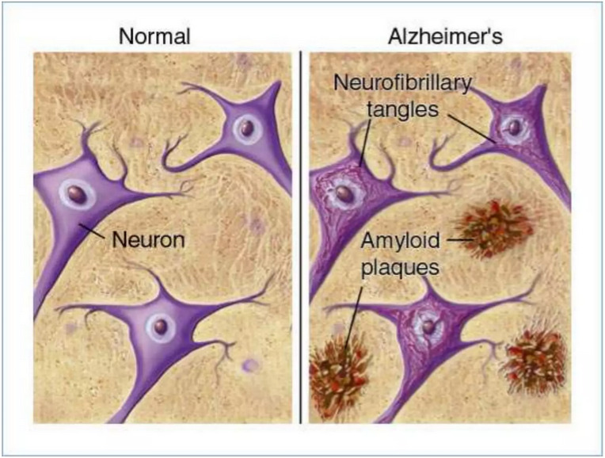
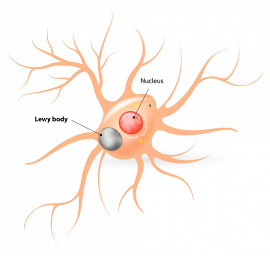
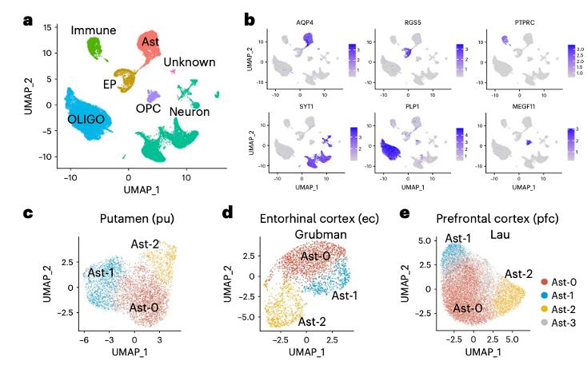
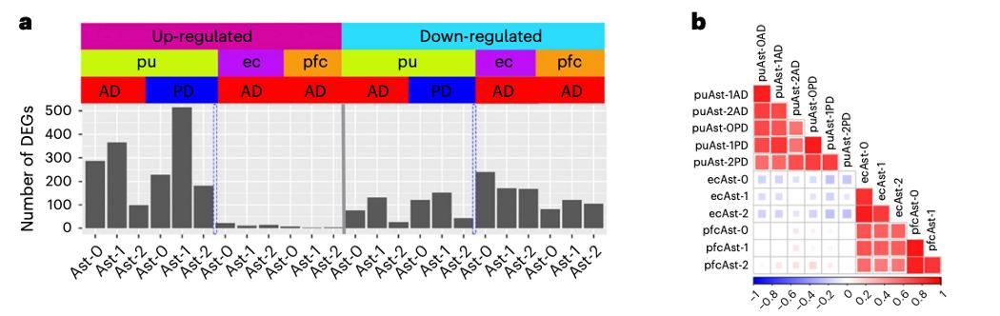
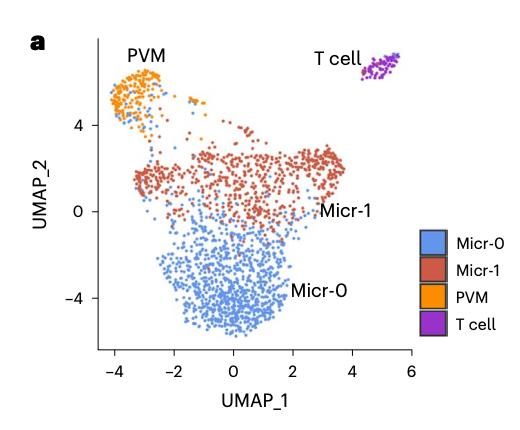
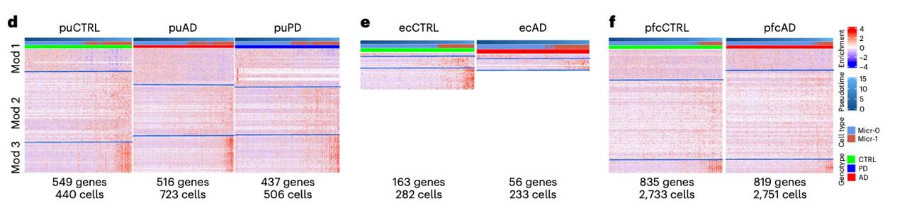
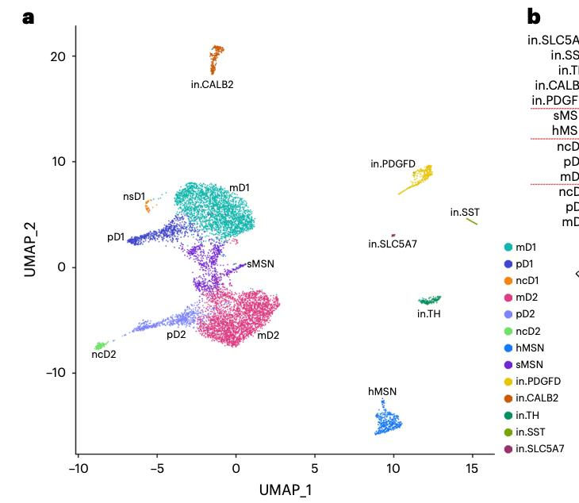

```{=html}
<!-- ── SHARED PIPELINE ENGINE (cargado una sola vez) ── -->
<style>
/* ── variables ── */
.pipeline-slide {
  --bg:     #080810;
  --panel:  #0e0e1a;
  --panel2: #090913;
  --border: #1e1a30;
  --brd2:   #2a2448;
  --accent: #ff4d8d;
  --blue:   #00bfff;
  --cyan:   #7ee8ff;
  --purple: #c084fc;
  --amber:  #ffd166;
  --red:    #ff4d6d;
  --green:  #39ff72;
  --dim:    #3a3450;
  --muted:  #6a5f8a;
  --text:   #c4b8e0;
  --bright: #ede8ff;
  --mono:   'JetBrains Mono', monospace;

  font-family: var(--mono);
  width: 100%;
  height: 640px;
  background: var(--bg);
  color: var(--text);
  display: grid;
  grid-template-rows: 30px 1fr;
  overflow: hidden;
  position: relative;
  isolation: isolate;
}

/* scanline — kept subtle */
.pipeline-slide::before {
  content: '';
  position: absolute;
  inset: 0;
  background: repeating-linear-gradient(
    0deg, transparent, transparent 2px,
    rgba(0,0,0,0.05) 2px, rgba(0,0,0,0.05) 4px
  );
  pointer-events: none;
  z-index: 50;
}

/* ── header ── */
.ps-header {
  display: flex;
  align-items: center;
  gap: 0;
  padding: 0 14px;
  height: 30px;
  flex: none;
  font-size: 0.68rem;
  font-weight: 800;
  letter-spacing: 0.12em;
  text-transform: uppercase;
  color: #000;
}
.ps-header.p1 { background: var(--blue);  }
.ps-header.p2 { background: var(--green); }
.ps-header.p3 { background: var(--amber); }
.ps-header.p4 { background: var(--red);   }
.ps-header-step { margin-left: auto; opacity: 0.7; font-size: 0.65rem; }

/* ── body ── */
.ps-body {
  display: grid;
  grid-template-columns: 1fr 300px;
  overflow: hidden;
  height: 100%;
}

/* ── map ── */
.ps-map {
  position: relative;
  overflow: hidden;
  background:
    repeating-linear-gradient(90deg, transparent 0 39px, rgba(168,85,247,0.03) 39px 40px),
    repeating-linear-gradient(0deg,  transparent 0 39px, rgba(168,85,247,0.03) 39px 40px),
    var(--panel2);
  border-right: 1px solid var(--brd2);
}
/* scan sweep */
@keyframes ps-scan { 0%{top:-2px} 100%{top:100%} }
.ps-map::after {
  content: '';
  position: absolute;
  left:0; right:0; height:1px;
  background: linear-gradient(90deg, transparent, rgba(126,232,255,0.08), transparent);
  animation: ps-scan 8s linear infinite;
  pointer-events: none;
  z-index: 2;
}

.ps-canvas {
  position: absolute;
  width: 1400px;
  height: 580px;
  transform: translateX(var(--pan-x, -60px));
}
.ps-canvas svg {
  position: absolute; inset: 0;
  width: 100%; height: 100%;
  pointer-events: none;
}

/* ── map controls ── */
.ps-controls {
  position: absolute;
  bottom: 0; left: 0; right: 0;
  display: flex;
  gap: 6px; align-items: center;
  padding: 5px 10px;
  background: linear-gradient(transparent, rgba(8,8,16,0.96) 35%);
  z-index: 10;
}
.ps-btn {
  padding: 3px 9px;
  border: 1px solid var(--brd2);
  background: var(--panel2);
  color: var(--muted);
  font-family: var(--mono);
  font-size: 0.6rem;
  cursor: pointer;
  text-transform: uppercase;
  letter-spacing: 0.08em;
  transition: all 0.1s;
}
.ps-btn:hover { border-color: var(--purple); color: var(--purple); }
.ps-btn.playing { border-color: var(--green); color: var(--green); }
.ps-pan { flex:1; accent-color: var(--accent); }
.ps-kbd {
  font-size: 0.56rem; color: var(--dim);
  display: flex; gap: 3px;
}
.ps-k {
  padding: 1px 4px;
  border: 1px solid var(--brd2);
  color: var(--dim); font-size: 0.54rem;
}

/* ── nodes ── */
.ps-node {
  position: absolute;
  transform: translate(-50%, -50%);
  width: 118px;
  background: var(--panel);
  border: 1px solid var(--brd2);
  padding: 6px 8px 8px;
  text-align: left;
  cursor: pointer;
  z-index: 3;
  font-family: var(--mono);
  transition: border-color 0.12s, box-shadow 0.12s, transform 0.12s;
}
.ps-node::before {
  content: attr(data-num);
  position: absolute; top:-1px; left:-1px;
  width:14px; height:14px;
  background: var(--border); color: var(--muted);
  font-size: 0.5rem;
  display: grid; place-items: center;
}
.ps-node:hover {
  border-color: var(--purple);
  box-shadow: 0 0 0 1px rgba(168,85,247,0.3);
  transform: translate(-50%,-50%) scale(1.06);
  z-index: 10;
}
.ps-node.active {
  border-color: var(--accent);
  box-shadow: 0 0 0 1px rgba(255,77,141,0.4), 0 0 12px rgba(255,77,141,0.15);
  z-index: 10;
}
.ps-node.energized {
  border-color: var(--cyan);
  box-shadow: 0 0 0 1px rgba(126,232,255,0.5), 0 0 8px rgba(126,232,255,0.2);
}
/* dim nodes that are not in the current phase */
.ps-node.other-phase {
  opacity: 0.25;
  filter: grayscale(0.7);
  pointer-events: none;
}

@keyframes ps-ping {
  0%{transform:translate(-50%,-50%) scale(1);opacity:1}
  100%{transform:translate(-50%,-50%) scale(1.35);opacity:0}
}
.ps-node.ping { animation: ps-ping 0.5s ease-out; }

.ps-node-top { display:flex; align-items:center; gap:4px; margin-bottom:3px; margin-top:2px; }
.ps-dot { width:7px; height:7px; border:2px solid; flex:none; position:relative; }
.ps-dot::after { content:''; position:absolute; inset:1px; opacity:0.6; }
.ps-dot.blue  { border-color:var(--blue);  } .ps-dot.blue::after  { background:var(--blue);  }
.ps-dot.green { border-color:var(--green); } .ps-dot.green::after { background:var(--green); }
.ps-dot.amber { border-color:var(--amber); } .ps-dot.amber::after { background:var(--amber); }
.ps-dot.red   { border-color:var(--red);   } .ps-dot.red::after   { background:var(--red);   }

.ps-node-label {
  font-size: 0.63rem;
  font-weight: 700;
  color: var(--bright);
  line-height: 1.2;
}

/* edge */
.ps-edge { fill:none; stroke-linecap:square; stroke-linejoin:miter; shape-rendering:crispEdges; }
/* dim edges outside current phase */
.ps-edge.other-phase { stroke-opacity: 0.12 !important; }

/* orb */
.ps-orb { pointer-events:none; filter:drop-shadow(0 0 4px rgba(126,232,255,0.9)); }

/* ── detail panel ── */
.ps-detail {
  background: var(--panel);
  display: grid;
  grid-template-rows: auto 1fr auto;
  overflow: hidden;
}

.ps-phase-bar {
  height: 3px;
}
.ps-phase-bar.p1 { background: var(--blue);  }
.ps-phase-bar.p2 { background: var(--green); }
.ps-phase-bar.p3 { background: var(--amber); }
.ps-phase-bar.p4 { background: var(--red);   }

.ps-detail-body {
  padding: 14px 13px 10px;
  overflow-y: auto;
  scrollbar-width: thin;
  scrollbar-color: var(--border) transparent;
  display: flex;
  flex-direction: column;
  gap: 8px;
}
.ps-detail-body::-webkit-scrollbar { width:3px; }
.ps-detail-body::-webkit-scrollbar-thumb { background:var(--border); }

@keyframes ps-fadein { from{opacity:0;transform:translateY(4px)} to{opacity:1;transform:translateY(0)} }
.ps-detail-body { animation: ps-fadein 0.2s ease; }

.ps-kicker {
  font-size: 0.56rem;
  color: var(--muted);
  letter-spacing: 0.14em;
  text-transform: uppercase;
}
.ps-kicker::before { content: '$ '; color: var(--accent); }

.ps-title {
  font-size: 1.05rem;
  font-weight: 800;
  color: var(--accent);
  line-height: 1.1;
  letter-spacing: -0.02em;
}

.ps-desc {
  font-size: 0.75rem;
  color: var(--text);
  line-height: 1.7;
  border-left: 2px solid rgba(0,191,255,0.22);
  padding-left: 10px;
  flex: 1;
}

/* step list in panel */
.ps-steplist {
  display: flex;
  flex-direction: column;
  gap: 4px;
  border-top: 1px solid var(--border);
  padding-top: 8px;
}
.ps-stepitem {
  display: flex;
  gap: 7px;
  align-items: center;
  padding: 5px 7px;
  border: 1px solid var(--border);
  background: var(--panel2);
  cursor: pointer;
  font-family: var(--mono);
  font-size: 0.68rem;
  color: var(--text);
  text-align: left;
  transition: border-color 0.1s;
}
.ps-stepitem:hover { border-color: var(--brd2); }
.ps-stepitem.active { border-color: var(--cyan); }
.ps-stepnum {
  width: 18px; height: 18px;
  display: grid; place-items: center;
  background: var(--border);
  font-size: 0.6rem; font-weight: 800;
  color: var(--muted); flex: none;
  font-family: var(--mono);
  transition: background 0.2s, color 0.2s;
}
.ps-stepitem.active .ps-stepnum { background: rgba(126,232,255,0.15); color: var(--cyan); }

/* nav row */
.ps-nav {
  display: flex;
  gap: 6px; align-items: center;
  padding: 8px 13px;
  border-top: 1px solid var(--border);
}
.ps-navbtn {
  padding: 3px 10px;
  border: 1px solid var(--brd2);
  background: var(--panel2);
  color: var(--muted);
  font-family: var(--mono);
  font-size: 0.62rem;
  cursor: pointer;
  transition: all 0.1s;
}
.ps-navbtn:hover:not(:disabled) { border-color: var(--accent); color: var(--accent); }
.ps-navbtn:disabled { opacity: 0.28; cursor: default; }
.ps-navlabel {
  flex:1; text-align:center;
  font-size: 0.6rem; color: var(--muted);
}
.ps-navlabel strong { color: var(--accent); }
</style>

<script>
// ── SHARED DATA ──
const PS_STATIONS = {
  "1":  { phase:"practica1", kicker:"P1 · QC y normalización",      title:"Juntar archivos del donador",                 desc:"Se separan los archivos de cada donador para no mezclar muestras. Es el punto de partida: acomodar, convertir y analizar." },
  "2":  { phase:"practica1", kicker:"P1 · QC y normalización",      title:"Convertir a .h5",                             desc:"Se pasa todo a un formato que abre rápido y evita perderse entre archivos sueltos, como cambiar hojas sueltas por una carpeta con broche." },
  "3":  { phase:"practica1", kicker:"P1 · QC y normalización",      title:"Cargar la muestra en Seurat",                 desc:"Abrir la carpeta y verificar que las piezas están completas. Aquí no comparamos muestras; solo revisamos si esta muestra está bien." },
  "4":  { phase:"practica1", kicker:"P1 · QC y normalización",      title:"Calcular métricas de calidad",                desc:"Genes por célula, moléculas y porcentaje de genes mitocondriales, ribosomales, de hemoglobina y plaquetas." },
  "5":  { phase:"practica1", kicker:"P1 · QC y normalización",      title:"Quitar lo que estorba",                       desc:"Eliminar células raras, vacías o duplicadas para quedarse solo con lo que realmente cuenta para el análisis." },
  "6":  { phase:"practica1", kicker:"P1 · QC y normalización",      title:"Normalizar con SCTransform",                  desc:"Estandarizar la información para que comparar donadores no sea injusto por diferencias técnicas entre muestras." },
  "7":  { phase:"practica2", kicker:"P2 · Reducción e integración", title:"Buscar grupos de células parecidas",           desc:"Se forman grupos con células semejantes usando PCA + UMAP, como juntar estaciones del metro con pasajeros de hábitos similares." },
  "8":  { phase:"practica2", kicker:"P2 · Reducción e integración", title:"Integrar muestras sin borrar lo importante",  desc:"Detectar y corregir diferencias técnicas entre laboratorios con Harmony para ver solo diferencias biológicas reales." },
  "9":  { phase:"practica3", kicker:"P3 · Anotación celular",       title:"Ponerle nombre a cada grupo",                 desc:"Se buscan genes marcadores para saber si cada cluster corresponde a una neurona, microglía, astrocito u otro tipo celular." },
  "10": { phase:"practica3", kicker:"P3 · Anotación celular",       title:"Ver qué genes separan mejor cada grupo",      desc:"Comparar genes por cluster con DotPlot, Heatmap y SingleR para etiquetar cada célula con su tipo correspondiente." },
  "11": { phase:"practica4", kicker:"P4 · Expresión diferencial",   title:"Control del ciclo celular",                   desc:"Identificar fases S y G2/M para evaluar si la variabilidad observada está influenciada por proliferación celular." },
  "12": { phase:"practica4", kicker:"P4 · Expresión diferencial",   title:"Comparar Control, Alzheimer y Parkinson",     desc:"Ver dónde cambian más las células entre condiciones con FindMarkers para descubrir los genes diferenciales por enfermedad." },
  "13": { phase:"practica4", kicker:"P4 · Expresión diferencial",   title:"Pseudobulk",                                  desc:"Calcular expresión promedio por gen en cada grupo con edgeR para comparar condiciones con validez estadística robusta." },
  "14": { phase:"practica4", kicker:"P4 · Expresión diferencial",   title:"Preparar salida para GO/KEGG",                desc:"Ordenar y filtrar la lista de genes diferenciales para convertirla en una explicación biológica interpretable." },
  "15": { phase:"practica4", kicker:"P4 · Expresión diferencial",   title:"Figuras para contar la historia",             desc:"UMAP comparativo, heatmap de marcadores y gráfica volcano para mostrar los cambios de forma visual y clara." },
  "16": { phase:"practica4", kicker:"P4 · Expresión diferencial",   title:"Salida final",                                desc:"Interpretar qué procesos cambian con enriquecimiento GO/KEGG y sintetizar las conclusiones biológicas del análisis." }
};

const PS_NODES = [
  { id:1,  x:100, y:100, dot:"blue",  phase:"practica1", next:[2]      },
  { id:2,  x:280, y:100, dot:"blue",  phase:"practica1", next:[3]      },
  { id:3,  x:460, y:100, dot:"blue",  phase:"practica1", next:[4]      },
  { id:4,  x:640, y:100, dot:"blue",  phase:"practica1", next:[5]      },
  { id:5,  x:820, y:100, dot:"blue",  phase:"practica1", next:[6]      },
  { id:6,  x:1000,y:100, dot:"blue",  phase:"practica1", next:[7]      },
  { id:7,  x:820, y:260, dot:"green", phase:"practica2", next:[8]      },
  { id:8,  x:620, y:260, dot:"green", phase:"practica2", next:[9,13]   },
  { id:9,  x:460, y:400, dot:"amber", phase:"practica3", next:[10]     },
  { id:10, x:280, y:400, dot:"amber", phase:"practica3", next:[11]     },
  { id:11, x:100, y:490, dot:"red",   phase:"practica4", next:[12]     },
  { id:12, x:280, y:490, dot:"red",   phase:"practica4", next:[13]     },
  { id:13, x:460, y:490, dot:"red",   phase:"practica4", next:[14]     },
  { id:14, x:640, y:490, dot:"red",   phase:"practica4", next:[15]     },
  { id:15, x:820, y:490, dot:"red",   phase:"practica4", next:[16]     },
  { id:16, x:1000,y:490, dot:"red",   phase:"practica4", next:[]       }
];

const PS_CONNS = [
  {from:1,to:2,k:"m"},{from:2,to:3,k:"m"},{from:3,to:4,k:"m"},
  {from:4,to:5,k:"m"},{from:5,to:6,k:"m"},{from:6,to:7,k:"m"},
  {from:7,to:8,k:"m"},{from:8,to:9,k:"m"},{from:8,to:13,k:"b"},
  {from:9,to:10,k:"m"},{from:10,to:11,k:"m"},{from:11,to:12,k:"m"},
  {from:12,to:13,k:"m"},{from:13,to:14,k:"m"},{from:14,to:15,k:"m"},
  {from:15,to:16,k:"m"}
];

// phase color class
const PS_PC = { practica1:'p1', practica2:'p2', practica3:'p3', practica4:'p4' };
// phase nodes
const PS_PHASE_NODES = {};
PS_NODES.forEach(n => { (PS_PHASE_NODES[n.phase] = PS_PHASE_NODES[n.phase]||[]).push(n.id); });

// ── GEOMETRY ──
function psClamp(v,a,b){return Math.max(a,Math.min(b,v));}
function psBuildPts(s,t){
  const hw=52,fwd=t.x>=s.x;
  const sa={x:fwd?s.x+hw:s.x-hw,y:s.y};
  const ta={x:fwd?t.x-hw:t.x+hw,y:t.y};
  if(!fwd&&ta.x>sa.x-30)ta.x=sa.x-30;
  if( fwd&&ta.x<sa.x+30)ta.x=sa.x+30;
  if(Math.abs(t.y-s.y)<50)return[sa,ta];
  const laneY=t.y-65,viaX=psClamp((sa.x+ta.x)/2,80,1320);
  return [{x:sa.x,y:sa.y+4},{x:viaX,y:sa.y+4},{x:viaX,y:laneY},{x:ta.x,y:laneY},{x:ta.x,y:ta.y+4}];
}
function psMakePath(s,t){
  const pts=psBuildPts(s,t);
  return 'M '+pts[0].x+' '+pts[0].y+' '+pts.slice(1).map(p=>`L ${p.x} ${p.y}`).join(' ');
}
function psEdgeColor(src){
  const pal={blue:'#00bfff',green:'#39ff72',amber:'#ffd166',red:'#ff4d6d'};
  return pal[src.dot]||'#39ff72';
}

// ── PER-SLIDE STATE ──
const PS_STATE = {};

function initSlide(containerId, phase) {
  const root = document.getElementById(containerId);
  if (!root) return;

  const phaseClass = PS_PC[phase];
  const phaseNodes = PS_PHASE_NODES[phase] || [];
  const phaseOrder = phaseNodes; // already in order

  // ── BUILD HTML ──
  root.innerHTML = `
    <div class="ps-header ${phaseClass}">
      <span>${phaseLabel(phase)}</span>
      <span class="ps-header-step" id="${containerId}-hdr">01 / ${phaseOrder.length}</span>
    </div>
    <div class="ps-body">
      <div class="ps-map" id="${containerId}-map">
        <div class="ps-canvas" id="${containerId}-canvas"></div>
        <div class="ps-controls">
          <button class="ps-btn" id="${containerId}-prev">◀</button>
          <button class="ps-btn" id="${containerId}-play">▶ play</button>
          <button class="ps-btn" id="${containerId}-next">▶▶</button>
          <input type="range" class="ps-pan" id="${containerId}-pan" min="0" max="100" value="0"/>
          <span class="ps-kbd"><span class="ps-k">←</span><span class="ps-k">→</span><span class="ps-k">SPC</span></span>
        </div>
      </div>
      <div class="ps-detail">
        <div class="ps-phase-bar ${phaseClass}"></div>
        <div class="ps-detail-body" id="${containerId}-body">
          <div class="ps-kicker" id="${containerId}-kicker"></div>
          <div class="ps-title"  id="${containerId}-title">—</div>
          <div class="ps-desc"   id="${containerId}-desc"></div>
          <div class="ps-steplist" id="${containerId}-steps"></div>
        </div>
        <div class="ps-nav">
          <button class="ps-navbtn" id="${containerId}-nprev">◀</button>
          <span   class="ps-navlabel">paso <strong id="${containerId}-num">1</strong> / ${phaseOrder.length}</span>
          <button class="ps-navbtn" id="${containerId}-nnext">▶</button>
        </div>
      </div>
    </div>
  `;

  // ── STATE ──
  const state = {
    active:   phaseOrder[0],
    shift:    0,
    playing:  false,
    playTimer: null,
    focusId:  0,
    svgEl:    null,
    nodeEls:  [],
    phase,
    phaseNodes,
    phaseOrder,
    containerId
  };
  PS_STATE[containerId] = state;

  buildMapFor(state);
  applyShiftFor(state, 0);
  setActiveFor(state, phaseOrder[0], false);
  buildStepListFor(state);
  wireControlsFor(state);
}

function phaseLabel(ph){
  return {practica1:'P1 · QC y Normalización',practica2:'P2 · Reducción e Integración',
          practica3:'P3 · Anotación Celular',practica4:'P4 · Expresión Diferencial'}[ph]||ph;
}

// ── BUILD MAP ──
function buildMapFor(state) {
  const {containerId, phase} = state;
  const canvas = document.getElementById(`${containerId}-canvas`);
  canvas.innerHTML = '';
  const svg = document.createElementNS('http://www.w3.org/2000/svg','svg');
  svg.setAttribute('viewBox','0 0 1400 580');
  svg.setAttribute('preserveAspectRatio','none');
  svg.setAttribute('aria-hidden','true');
  canvas.appendChild(svg);
  state.svgEl = svg;

  // draw all edges — dim those outside phase
  PS_CONNS.forEach(c => {
    const s = PS_NODES.find(n=>n.id===c.from);
    const t = PS_NODES.find(n=>n.id===c.to);
    if (!s||!t) return;
    const inPhase = s.phase===phase && t.phase===phase;
    const path = document.createElementNS('http://www.w3.org/2000/svg','path');
    path.setAttribute('class', 'ps-edge' + (inPhase?'':' other-phase'));
    path.setAttribute('d', psMakePath(s,t));
    path.setAttribute('stroke', psEdgeColor(s));
    path.setAttribute('stroke-width', c.k==='b'?'2.5':'3.5');
    path.setAttribute('stroke-opacity', inPhase ? (c.k==='b'?'0.45':'0.8') : '0.1');
    path.setAttribute('stroke-dasharray', c.k==='b'?'5 4':'none');
    svg.appendChild(path);
  });

  // draw all nodes
  PS_NODES.forEach(node => {
    const d = PS_STATIONS[String(node.id)] || {};
    const inPhase = node.phase === phase;
    const btn = document.createElement('button');
    btn.type = 'button';
    btn.className = 'ps-node' + (inPhase?'':' other-phase');
    btn.dataset.num = String(node.id).padStart(2,'0');
    btn.dataset.id  = String(node.id);
    btn.style.left  = `${node.x}px`;
    btn.style.top   = `${node.y}px`;
    btn.innerHTML   = `
      <div class="ps-node-top">
        <div class="ps-dot ${node.dot}"></div>
        <span class="ps-node-label">${d.title||node.id}</span>
      </div>
    `;
    if (inPhase) btn.addEventListener('click', () => {
      stopPlayFor(state);
      setActiveFor(state, node.id);
    });
    canvas.appendChild(btn);
  });

  state.nodeEls = Array.from(canvas.querySelectorAll('.ps-node'));
}

// ── BUILD STEP LIST ──
function buildStepListFor(state) {
  const {containerId, phaseOrder} = state;
  const list = document.getElementById(`${containerId}-steps`);
  list.innerHTML = phaseOrder.map(id => {
    const d = PS_STATIONS[String(id)]||{};
    return `<button class="ps-stepitem" data-id="${id}" type="button">
      <span class="ps-stepnum">${id}</span>
      <span style="font-size:0.65rem;color:var(--bright);line-height:1.3">${d.title||id}</span>
    </button>`;
  }).join('');
  list.querySelectorAll('.ps-stepitem').forEach(el =>
    el.addEventListener('click', () => {
      stopPlayFor(state);
      setActiveFor(state, Number(el.dataset.id));
    })
  );
}

function refreshStepListFor(state) {
  const {containerId, active} = state;
  document.querySelectorAll(`#${containerId}-steps .ps-stepitem`).forEach(el =>
    el.classList.toggle('active', Number(el.dataset.id) === active)
  );
}

// ── SET ACTIVE ──
function setActiveFor(state, id, animate = true) {
  const prev = state.active;
  state.active = id;
  const d = PS_STATIONS[String(id)] || {};
  const idx = state.phaseOrder.indexOf(id);

  // detail panel
  const body = document.getElementById(`${state.containerId}-body`);
  document.getElementById(`${state.containerId}-kicker`).textContent = d.kicker||'';
  document.getElementById(`${state.containerId}-title`).textContent  = d.title||'';
  document.getElementById(`${state.containerId}-desc`).textContent   = d.desc||'';
  // re-trigger animation
  body.style.animation='none'; body.offsetHeight; body.style.animation='';
  body.scrollTop = 0;

  // header step
  document.getElementById(`${state.containerId}-hdr`).textContent =
    String(idx+1).padStart(2,'0') + ' / ' + state.phaseOrder.length;
  document.getElementById(`${state.containerId}-num`).textContent = idx + 1;

  // nav buttons
  document.getElementById(`${state.containerId}-nprev`).disabled = idx <= 0;
  document.getElementById(`${state.containerId}-nnext`).disabled = idx >= state.phaseOrder.length - 1;

  // node visuals
  state.nodeEls.forEach(n => {
    n.classList.toggle('active',     Number(n.dataset.id) === id);
    n.classList.remove('energized');
  });
  energizeFor(state, id, true);

  // ping
  const btn = state.nodeEls.find(n => Number(n.dataset.id) === id);
  if (btn) {
    btn.classList.remove('ping');
    void btn.offsetWidth;
    btn.classList.add('ping');
    setTimeout(() => btn.classList.remove('ping'), 550);
  }

  // pan
  const node = PS_NODES.find(n => n.id === id);
  if (node) panToFor(state, node.x);

  // orb
  if (animate && prev !== id) {
    state.focusId++;
    animateOrbFor(state, bfsPath(prev, id), state.focusId);
  }

  refreshStepListFor(state);
}

function energizeFor(state, id, on) {
  const n = state.nodeEls.find(b => Number(b.dataset.id) === id);
  if (n) n.classList.toggle('energized', on);
}

// ── BFS PATH ──
function bfsPath(from, to) {
  if (from===to) return [from];
  const q=[[from]],vis=new Set([from]);
  while(q.length){
    const path=q.shift(),last=path[path.length-1];
    for(const c of PS_CONNS){
      const other=c.from===last?c.to:c.to===last?c.from:null;
      if(!other||vis.has(other))continue;
      const np=[...path,other];
      if(other===to)return np;
      vis.add(other);q.push(np);
    }
  }
  return [from,to];
}

// ── ORB ──
function animateOrbFor(state, pathIds, runId) {
  const svg = state.svgEl;
  if (!svg || pathIds.length < 2) return;
  const orb = document.createElementNS('http://www.w3.org/2000/svg','rect');
  orb.setAttribute('width','7'); orb.setAttribute('height','7');
  orb.setAttribute('class','ps-orb');
  orb.setAttribute('fill','#7ee8ff'); orb.setAttribute('stroke','#c084fc'); orb.setAttribute('stroke-width','1');
  svg.appendChild(orb);
  const runStep = idx => {
    if (runId !== state.focusId) { orb.remove(); return; }
    if (idx >= pathIds.length-1) { orb.remove(); energizeFor(state, pathIds[pathIds.length-1], true); return; }
    const s=PS_NODES.find(n=>n.id===pathIds[idx]);
    const t=PS_NODES.find(n=>n.id===pathIds[idx+1]);
    const mp=document.createElementNS('http://www.w3.org/2000/svg','path');
    mp.setAttribute('d',psMakePath(s,t)); mp.setAttribute('fill','none'); mp.setAttribute('stroke','none');
    svg.appendChild(mp);
    const len=mp.getTotalLength(),t0=performance.now();
    const frame=now=>{
      if(runId!==state.focusId){mp.remove();orb.remove();return;}
      const p=Math.min(1,(now-t0)/420);
      const pt=mp.getPointAtLength(len*p);
      orb.setAttribute('x',String(pt.x-3.5)); orb.setAttribute('y',String(pt.y-3.5));
      if(p<1){requestAnimationFrame(frame);return;}
      mp.remove(); energizeFor(state,s.id,false); energizeFor(state,t.id,true);
      setTimeout(()=>runStep(idx+1),80);
    };
    requestAnimationFrame(frame);
  };
  runStep(0);
}

// ── PAN ──
function maxShiftFor(state) {
  const map = document.getElementById(`${state.containerId}-map`);
  return map ? Math.max(0, 1400 - map.clientWidth) : 0;
}

function applyShiftFor(state, s) {
  const max = maxShiftFor(state);
  s = Math.max(0, Math.min(max, s));
  state.shift = s;
  const canvas = document.getElementById(`${state.containerId}-canvas`);
  if (canvas) canvas.style.setProperty('--pan-x', `${-s}px`);
  const slider = document.getElementById(`${state.containerId}-pan`);
  if (slider) slider.value = max > 0 ? Math.round((s/max)*100) : 0;
}

function panToFor(state, nodeX) {
  const map = document.getElementById(`${state.containerId}-map`);
  if (!map) return;
  const vw = map.clientWidth, max = maxShiftFor(state);
  if (max <= 0) return;
  const margin = 80;
  if (nodeX >= state.shift + margin && nodeX <= state.shift + vw - margin) return;
  let target = Math.max(0, Math.min(max, nodeX - vw/2));
  const start = state.shift, delta = target - start, dur = 360, t0 = performance.now();
  const ease = t => t<0.5?2*t*t:-1+(4-2*t)*t;
  const step = now => {
    const p = Math.min(1,(now-t0)/dur);
    applyShiftFor(state, Math.round(start+delta*ease(p)));
    if (p<1) requestAnimationFrame(step);
  };
  requestAnimationFrame(step);
}

// ── AUTOPLAY ──
function stepFwdFor(state) {
  const i = state.phaseOrder.indexOf(state.active);
  if (i < state.phaseOrder.length - 1) { setActiveFor(state, state.phaseOrder[i+1]); return true; }
  return false;
}
function stepBackFor(state) {
  const i = state.phaseOrder.indexOf(state.active);
  if (i > 0) { setActiveFor(state, state.phaseOrder[i-1]); return true; }
  return false;
}

function setPlayingFor(state, val) {
  state.playing = val;
  clearTimeout(state.playTimer);
  const btn = document.getElementById(`${state.containerId}-play`);
  if (!btn) return;
  if (val) {
    btn.textContent = '⏸ pause'; btn.classList.add('playing');
    state.playTimer = setTimeout(function tick(){
      if (!state.playing) return;
      if (!stepFwdFor(state)) { state.playing=false; btn.textContent='▶ play'; btn.classList.remove('playing'); return; }
      state.playTimer = setTimeout(tick, 2400);
    }, 2400);
  } else {
    btn.textContent = '▶ play'; btn.classList.remove('playing');
  }
}
function stopPlayFor(state) { setPlayingFor(state, false); }

// ── CONTROLS ──
function wireControlsFor(state) {
  const cid = state.containerId;
  document.getElementById(`${cid}-play`).addEventListener('click', () => setPlayingFor(state, !state.playing));
  document.getElementById(`${cid}-next`).addEventListener('click', () => { stopPlayFor(state); stepFwdFor(state); });
  document.getElementById(`${cid}-prev`).addEventListener('click', () => { stopPlayFor(state); stepBackFor(state); });
  document.getElementById(`${cid}-nnext`).addEventListener('click', () => stepFwdFor(state));
  document.getElementById(`${cid}-nprev`).addEventListener('click', () => stepBackFor(state));
  document.getElementById(`${cid}-pan`).addEventListener('input', e =>
    applyShiftFor(state, Math.round((Number(e.target.value)/100)*maxShiftFor(state)))
  );

  // drag
  const map = document.getElementById(`${cid}-map`);
  let drag=false, startX=0, startShift=0;
  map.addEventListener('mousedown', e=>{
    if(e.target.closest('.ps-node')) return;
    drag=true; startX=e.clientX; startShift=state.shift;
    map.style.cursor='grabbing'; e.preventDefault();
  });
  window.addEventListener('mousemove', e=>{ if(drag) applyShiftFor(state, startShift-(e.clientX-startX)); });
  window.addEventListener('mouseup', ()=>{ if(drag){drag=false;map.style.cursor='';} });
  map.addEventListener('wheel', e=>{
    const dx=Math.abs(e.deltaX)>Math.abs(e.deltaY)?e.deltaX:e.deltaY;
    if(!dx) return; e.preventDefault();
    applyShiftFor(state, state.shift+dx*(e.deltaMode?18:1));
  },{passive:false});

  // keyboard — only when this slide's map is hovered
  map.addEventListener('keydown', e=>{
    if(e.key==='ArrowRight'){e.preventDefault();stopPlayFor(state);stepFwdFor(state);}
    if(e.key==='ArrowLeft') {e.preventDefault();stopPlayFor(state);stepBackFor(state);}
    if(e.key===' '){e.preventDefault();setPlayingFor(state,!state.playing);}
  });
  map.setAttribute('tabindex','0');
}
</script>
```

## Abstract del artículo

::::: columns
::: {.column width="80%"}
Este atrículo describe los estados transcriptómicos de nucelos individuales, específicamente en subpoblaciones de 3 tipos celulares:

-   **Astrocitos**: Se decribieron tres sub-poblaciones de astrocitos altamente conservadas entre ratones y humanos. Espefícicamente, se revelaron características similares entre astrocitos de AD y PD, así como sus diferencias regionales que contribuyen a la neurodegeneración y amiloidopatías.

-   **Microglías**: En el caso de las microglías activadas, los cambios transcriptómicos entre ámbas patologías son únicas para cada desorden.

-   **Indeterminadas**: Por último, también describieron los perfiles transcriptómicos de poblaciones no descritas anteriormente, viendo como cambian en ámbas patologías.
:::

::: {.column width="20%"}
[**Paper:** Xu, J., et. al (2023). Human striatal glia differentially contribute to AD- and PD-specific neurodegeneration. Nature Aging, 3(3), 346–365. <https://doi.org/10.1038/s43587-023-00363-8>]{style="font-size:70%;"}

[AD: Alzheimer's disease, PD: Parkinson's disease]{style="font-size:70%;"}
:::
:::::

## Las proteínas defectuosas por patología son:

:::: columns
**AD**:

- Proteínas Beta-Amiloide

- Neurofibrillas de proteína Tau

**PD**:

- Cuerpos de Lewy

<div style="font-size:70%;">

En un cerebro no patológico, la **microglía** actúa como un limpiador de estas acumulaciones. Esto lo hace mediante la **fagocitosis** de acumulaciones proteicas, ya sean extra o intracelulares. En este último caso, puede fagocitarse la neurona completa.

</div>

::: {.column width="30%"}

{ width=90% }


:::


::: {.column width="30%"}

:::
::: {.column width="30%"}

{ width=90% }

:::

::::
## Objetivo

Conociendo esta información previa, es evidente que tanto AD como PD comparten muchas características. Es por esto que las diferencias y similitudes entre los pathways que las producen son muchas veces, **desconocidas**.

Este artículo propone que el perfil transcriptómico de las microglias en ámbos desordenes comparados con los controles nos puede dar más información acerca de las diferencias entre si y como afecta la neurodegeneración y patologías amiloides.

## Descripción de los datos

::::: columns
::: {.column width="80%"}
Información general:

-   **Bioproject**: PRJNA675355

-   **Número de acceso de la base de datos GEO**: GSE161045

-   **Especie**: Homo sapiens

-   **Número de transcriptomas**: 12

-   **Número de réplicas biológicas**: *6 de control* (SRX9456983, SRX9456984, SRX9456985, SRX9456986), *4 replicas de Parkinson disease* (SRX9456991, SRX9456992, SRX9456993, SRX9456994), y 4 de Alzheimer Disease (SRX9456987, SRX9456988, SRX9456989, SRX9456990).

-   **Secuenciador empleado**: Illumina Nova-seq 6000
:::

::: {.column width="20%"}
[*DISCLAIMER: Todos los pacientes declararon el consentimiento de donación de sus órganos antes de la aparición de discapacidad cognitiva.*]{style="font-size:70%;"}

[*En los casos donde no, fue el allegado más cercano el que declaró el consentimiento.*]{style="font-size:70%;"}
:::
:::::

## Diseño Experimental

Los pasos seguidos a grandes rasgos son:

-   

    1.  Tejido cerebral clinica y neuropatológicamente bien definido fue recolectado de donadores humanos fallecidos.

-   

    2.  Se clasificaron los estadios de las enfermedades en base a acumulaciones de proteína beta amiloide.

-   

    3.  Se hizo snRNA-seq del tejido cerebral y se alineo contra la referencia después del curamiento y limpieza de datos.

Esto se hizo con el fin de agrupar poblaciones celulares entre los tejidos y observar las diferencias entre los astrocitos del grupo de control, con PD o AD, así como también de células inmunes y neuronas. También se relaizó un análisis de expresión diferencial en cada muestra.

# Pipeline ([Version completa](https://3lconejo.github.io/Proyecto-Final-scRNA-seq/))

## Control de calidad y normalización {.slide-p1}

```{=html}
<div class="pipeline-slide" id="slide-p1" data-phase="practica1"></div>
<script>initSlide('slide-p1','practica1')</script>
```

## Reducción de dimensiones e integración {.slide-p2}

```{=html}
<div class="pipeline-slide" id="slide-p2" data-phase="practica2"></div>
<script>initSlide('slide-p2','practica2')</script>
```

## Biomarcadores y anotación celular {.slide-p3}

```{=html}
<div class="pipeline-slide" id="slide-p3" data-phase="practica3"></div>
<script>initSlide('slide-p3','practica3')</script>
```

## Expresión diferencial {.slide-p4}

```{=html}
<div class="pipeline-slide" id="slide-p4" data-phase="practica4"></div>
<script>initSlide('slide-p4','practica4')</script>
```

## Resultados del paper



## Resultados del paper



## Resultados del paper



## Resultados del paper



## Resultados del paper


